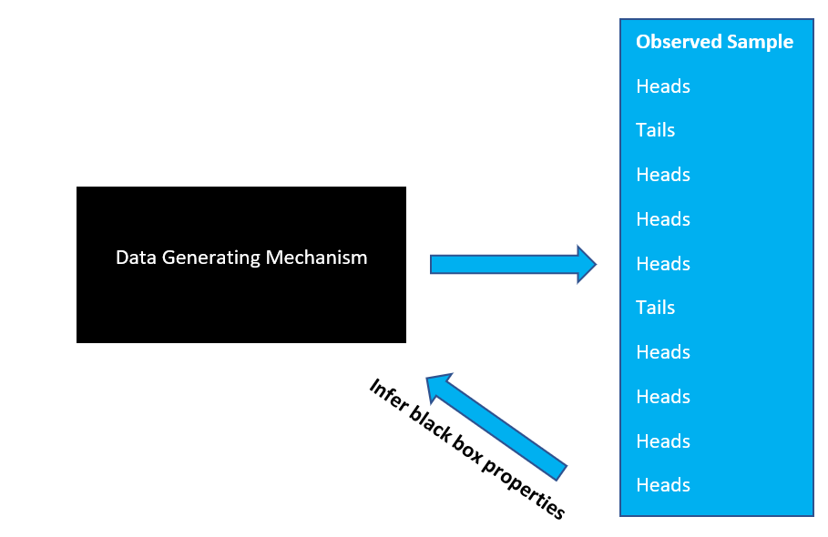
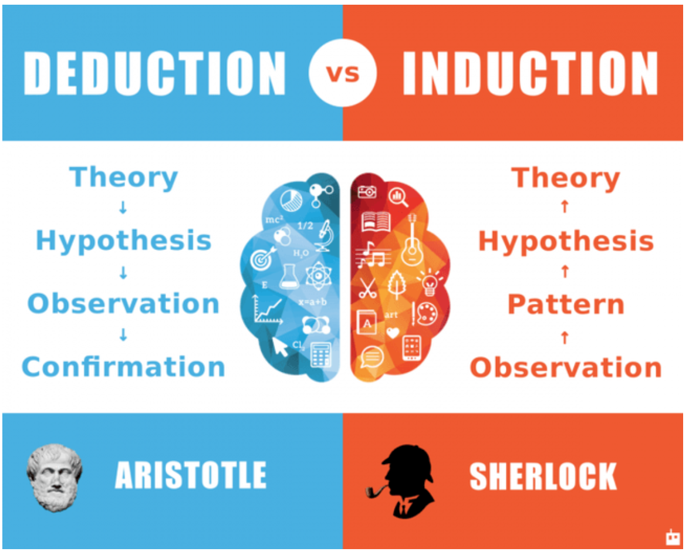
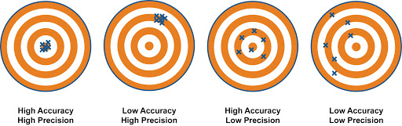
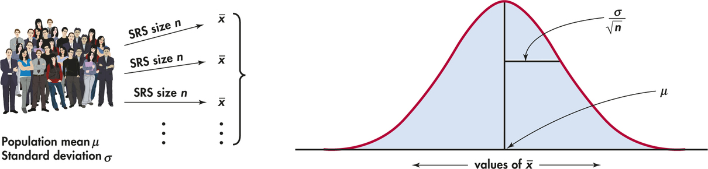
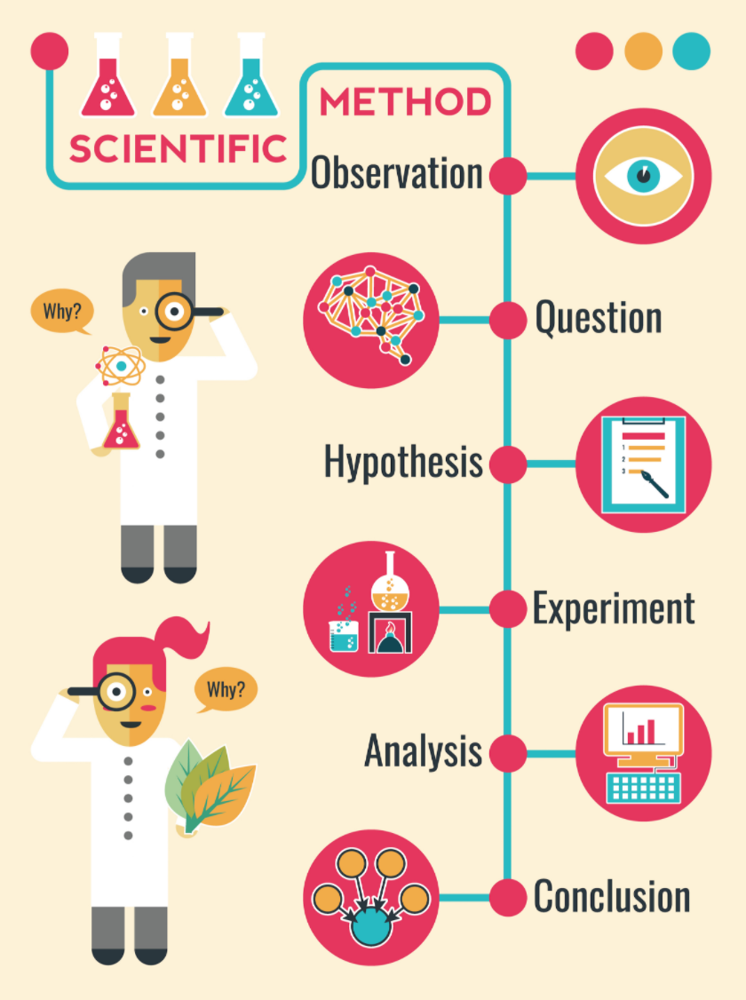
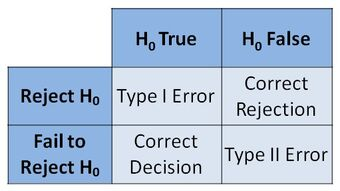

```{r setup, include=FALSE}
knitr::opts_chunk$set(echo=FALSE, warning=FALSE, message=FALSE, fig.width=6, fig.height=6)

library(tidyverse)
library(readr)
library(shiny)
library(rmarkdown)
```

# Introduction 

**Previous Sessions**: focused on data management and visualization with coding

**Now**: focus on statistical analysis of data

**Objectives**

- Conceptual understanding of statistics 
- Common pitfalls  
- Analytic methods 
- Method implementation in R 

# Populations, Samples, Data Properties
**Common Viewpoint**:
<center>
<figure>
    
    <figcaption></figcaption>
</figure>
</center>

**Limitations**:

- Assumes full information can be obtained 
- Assumes randomness ONLY from sampling part of group  
- Doesn't work with many examples of interest (coin tossing) 
- Doesn't allow for large/"infinite" sampling

# Populations, Samples, Data Properties
**Alternative Viewpoint**: Data Generating Mechanism
<center>
<figure>
    
    <figcaption></figcaption>
</figure>
</center>

Ex.:  What is the **probability** of seeing a heads after flipping coin?

# Populations, Samples, Data Properties
Statistical analysis uses both **inductive** and **deductive** reasoning
<center>
<figure>
    
    <figcaption></figcaption>
</figure>
</center>

We **infer** systematic properties and **test** hypotheses based on data

Inferences are **probabilistic** due to unavoidable uncertainty from only seeing output of process

# Parameters and Estimation
**Parameters** = Fixed properties of "black box"

Determine "signal" present in process with random variation being "noise"

**Examples**:

- Variable Distribution
- Mean, Median ("center")
- Variance, Standard Deviation ("spread")
- Probability of outcomes

# Parameters and Estimation
```{r example_properties, fig.width=7, fig.height=7}
plot(x=seq(from = -3, to = 3, by=0.25), y=dnorm(x=seq(from = -3, to = 3, by=0.25)), type = "b",
     xlab="", ylab="", main="Standard Normal Distribution\nMean = 0; Standard Deviation = 1")
```

# Parameters and Estimation
**First Step**: Choose parameter(s) we want to estimate

**Second Step**: Determine method for estimation

**Third Step**: Assess estimation

**Concern**: How do we take into account the probabilistic uncertainty?

<center>
<figure>
    
    <figcaption></figcaption>
</figure>
</center>

# Parameters and Estimation
**Estimator** = function of observed data

**Sample** = $(X_1, X_2, \ldots, X_n)$ from chosen population

**Exs.**:

Sample Mean = $(X_1 + X_2 + \ldots + X_n)/n = \bar{X}$

Sample Variance = $[(X_1 - \bar{X})^2+(X_2 - \bar{X})^2+ \ldots+(X_n - \bar{X})^2]/n = \hat{\sigma^2}$

# Parameters and Estimation
Estimate will vary from sample to sample.  How to measure this variability?

```{r estimate_sim_variance, fig.width=6, fig.height=6}
no_of_samples <- 10
n <- 50

estimate_vector_mean <- rep(NA, no_of_samples)
estimate_vector_var <- rep(NA, no_of_samples)

for(i in 1:no_of_samples){
  set.seed(i)
  data <- rnorm(n)
  # sample mean
  estimate_vector_mean[i] <- mean(data)
  estimate_vector_var[i] <- var(data)
}
plot(x=seq(from = -3, to = 3, by=0.25), y=dnorm(x=seq(from = -3, to = 3, by=0.25)), type = "b",
     xlab="", ylab="", main="Standard Normal Distribution\nMean = 0; Standard Deviation = 1")
paged_table(data.frame("Sample_Mean" = round(estimate_vector_mean, 4), 
                       "Sample_Variance" = round(estimate_vector_var, 4),
                       "n"=n))
```

**Answer**: Standard Error and Confidence Intervals

# Parameters and Estimation
**Standard Error** = Variance of Estimator

**Confidence Interval** = Interval of plausible values for parameter based on sample

<center>
<figure>
    
    <figcaption></figcaption>
</figure>
</center>

# Parameters and Estimation
**CI Interpretation**: 95% of intervals from sampled data will include true parameter value
```{r confident_int_plot, results='asis'}
no_of_samples <- 20
n <- 50

estimate_list <- list()

for(i in 1:no_of_samples){
  set.seed(i)
  data <- rnorm(n)
  
  estimate_list[[i]] <- list()
  estimate_list[[i]][["sample"]] <- i
  estimate_list[[i]][["mean_est"]] <- mean(data)
  estimate_list[[i]][["confint_lower"]] <- t.test(data)$conf.int[1]
  estimate_list[[i]][["confint_upper"]] <- t.test(data)$conf.int[2]

  estimate_list[[i]] <- data.frame(estimate_list[[i]]) %>%
    mutate(color_int = ifelse(confint_lower<0 & confint_upper>0, TRUE, FALSE))
}
estimate_df <- do.call("rbind", estimate_list)

ggplot(data = estimate_df, mapping=aes(x=sample, y=mean_est))+
  geom_errorbar(mapping=aes(ymin=confint_lower, ymax=confint_upper, y=mean_est, 
                            color=color_int))+
  scale_color_manual(values=c("red", "black"))+
  labs(y="Sample Mean (95% CI)", x="Sample Number")+
  geom_hline(yintercept = 0)+
  coord_flip()+
  theme_bw()+
  theme(legend.position = "none")
```

# Hypothesis Testing
<center>
<figure>
    
    <figcaption></figcaption>
</figure>
</center>

# Hypothesis Testing
**Statistical Analogue**: Hypothesis Testing for parameter(s)

**Example**:

**Scientific Hypothesis**: 
Infants at 12 months with Autism (ASD) have larger brain volumes then those without ASD

**Statistical Hypothesis**: 
$\mu_{ASD, 12}>\mu_{ASD_{Neg}, 12}$

where $\mu_{x, 12}=$ mean of total brain volume at 12 months of age for group "x"

# Hypothesis Testing
**For Scientific Testing**: Focused on **falsifying** claim

**For Statistical Testing**: Uncertainty $\implies$ **cannot** "falsify" claim

**instead**

judge evidence to see if one has "enough" to "reject" claim

# Hypothesis Testing
**Process**:

**Step One**: Determine **null** (baseline claim) and **alternative** hypotheses

**Step Two**: Determine quantities used as evidence to make decision (test statistic)

**Step Three**: Evaluate evidence

# Hypothesis Testing
**Evaluating Evidence**:

**Method 1**: Binary decision

- Choose to reject or fail to reject null
- **Do not** "accept" the null or "prove" the null or alternative are true
- **Pro**: Direct conclusion made, may be needed for clinical action
- **Con**: Binary decisions often made using some threshold, reduces info in data
<center>
<figure>
    
    <figcaption></figcaption>
</figure>
</center>

**Method 2**: Continuous evaluation

- **Pro**: More complete reflection of uncertainty in data, thresholds may be arbitrary
- **Con**: Conclusions less decisive, may be diffcult to put results into action
<center>
<figure>
    
    <figcaption></figcaption>
</figure>
</center>

# Hypothesis Testing
**Test Statistic**: Function of data used to evaluate null hypothesis claim

**Example**: Recall our standard normal distribution example
```{r example_properties_2, fig.width=7, fig.height=7}
plot(x=seq(from = -3, to = 3, by=0.25), y=dnorm(x=seq(from = -3, to = 3, by=0.25)), type = "b",
     xlab="", ylab="", main="Standard Normal Distribution\nMean = 0; Standard Deviation = 1")
```

Given this population, suppose we wanted to evaluate the following:

$H_0$ (Null): mean $=0$

$H_1$ (Alt.): mean $\neq 0$

**Idea**: Let's compare the sample mean from a single sample to 0

**Issue**: How to determine "difference" from 0 given random sampling variability?

**Idea**: Determine distribution of sample mean to determine correspondance with $H_0$

# Hypothesis Testing
**Sample Mean Distribution**: Function of data used to evaluate null hypothesis claim
```{r sample_mean_dist, results='asis'}
sample_reps <- c(50, 100, 500, 1000)
n <- 100

estimate_list <- list()

for(j in 1:length(sample_reps)){
 no_of_samples <-  sample_reps[j]
  for(i in 1:no_of_samples){
    set.seed(i)
    data <- rnorm(n)
    
    estimate_list[[i]] <- list()
    estimate_list[[i]][["sample"]] <- i
    estimate_list[[i]][["mean_est"]] <- mean(data)
    estimate_list[[i]][["confint_lower"]] <- t.test(data)$conf.int[1]
    estimate_list[[i]][["confint_upper"]] <- t.test(data)$conf.int[2]
  
    estimate_list[[i]] <- data.frame(estimate_list[[i]]) %>%
      mutate(color_int = ifelse(confint_lower<0 & confint_upper>0, TRUE, FALSE))
  }
  estimate_df <- do.call("rbind", estimate_list)
  
  print(ggplot(data = estimate_df, mapping=aes(x=mean_est))+
    geom_histogram()+
    labs(x="", y="", 
         title=paste0("Distribution of sample mean across simulated samples with n = ", n),
         subtitle = paste0("Number of samples = ", no_of_samples))+
    theme_bw()+
    theme(axis.text.y=element_blank(),
          axis.ticks.y=element_blank()))
}
```

# Hypothesis Testing
**Note**: Need enough samples to accurately estimate distribution (i.e. sample size)

**Observation**: Samples goes up $\implies$ estimated distribution of **sample mean** "converges" to normal curve

Turns out, this is a **mathematical fact** for **any** distribution, with random samples

Referred to as the **Central Limit Theorem (CLT)**

# Hypothesis Testing
**Recall**: Need distribution of sample mean to determine "rare" outcome

**From CLT**, we know 

```{r sample_mean_clt, results='asis'}
sample_reps <- 1000
n <- 100

estimate_list <- list()

for(j in 1:length(sample_reps)){
 no_of_samples <-  sample_reps[j]
  for(i in 1:no_of_samples){
    set.seed(i)
    data <- rnorm(n)
    
    estimate_list[[i]] <- list()
    estimate_list[[i]][["sample"]] <- i
    estimate_list[[i]][["mean_est"]] <- mean(data)
    estimate_list[[i]][["confint_lower"]] <- t.test(data)$conf.int[1]
    estimate_list[[i]][["confint_upper"]] <- t.test(data)$conf.int[2]
  
    estimate_list[[i]] <- data.frame(estimate_list[[i]]) %>%
      mutate(color_int = ifelse(confint_lower<0 & confint_upper>0, TRUE, FALSE))
  }
  estimate_df <- do.call("rbind", estimate_list)
  
  print(ggplot(data = estimate_df, mapping=aes(x=mean_est))+
    geom_histogram()+
    labs(x="", y="", 
         title=paste0("Distribution of sample mean across simulated samples with n = ", n),
         subtitle = paste0("Number of samples = ", no_of_samples))+
    theme_bw()+
    theme(axis.text.y=element_blank(),
          axis.ticks.y=element_blank()))
}
```

is an accurate estimate of this distribution, **assuming the null hypothesis** of mean = 0

# Hypothesis Testing
Suppose we obtain a sample of size **n=100** and compute the sample mean

Let's compare this observed sample mean to the expected distribution of values under the null

```{r sample_mean_clt_vs_obs, results='asis'}
sample_reps <- 1000
n <- 100

estimate_list <- list()

for(j in 1:length(sample_reps)){
 no_of_samples <-  sample_reps[j]
  for(i in 1:no_of_samples){
    set.seed(i)
    data <- rnorm(n)
    
    estimate_list[[i]] <- list()
    estimate_list[[i]][["sample"]] <- i
    estimate_list[[i]][["mean_est"]] <- mean(data)
    estimate_list[[i]][["confint_lower"]] <- t.test(data)$conf.int[1]
    estimate_list[[i]][["confint_upper"]] <- t.test(data)$conf.int[2]
  
    estimate_list[[i]] <- data.frame(estimate_list[[i]]) %>%
      mutate(color_int = ifelse(confint_lower<0 & confint_upper>0, TRUE, FALSE))
  }
  estimate_df <- do.call("rbind", estimate_list)
  
  # Get another sample mean to compare
  set.seed(1)
  data <- rnorm(n)
  mean_check <- mean(data)
  
  print(ggplot(data = estimate_df, mapping=aes(x=mean_est))+
    geom_histogram()+
    labs(x="", y="", 
         title=paste0("Distribution of sample mean across simulated samples with n = ", n),
         subtitle = paste0("Number of samples = ", no_of_samples))+
    geom_vline(xintercept = mean_check)+
    geom_text(aes(x=mean_check, y=120, label="Obs. Sample Mean"))+
    theme_bw()+
    theme(axis.text.y=element_blank(),
          axis.ticks.y=element_blank()))
}
```

# Hypothesis Testing
Can we quantify this comparison?  Yes

1) Compute Test Statistic value = statistic whose distriubtion is known under null

In this case from above, sample mean = one possible test statistic

2) Compute "probability-based" measure = probability of observing sample mean as or extreme then seen in data

- **low** probability = **unlikely** event under null $\implies$ observed sample **poorly matches** with null
- **high** probability = **likely** event under null $\implies$ observed sample **matches** with null

This measure is denoted as a **p-value** = measure of correspondence between sample and null

# Hypothesis Testing
Let's compute the p-value in the above example

```{r sample_mean_clt_pval, results='asis'}
sample_reps <- 1000
n <- 100

estimate_list <- list()

 no_of_samples <-  sample_reps
  for(i in 1:no_of_samples){
    set.seed(i)
    data <- rnorm(n)
    
    estimate_list[[i]] <- list()
    estimate_list[[i]][["sample"]] <- i
    estimate_list[[i]][["mean_est"]] <- mean(data)
    estimate_list[[i]][["confint_lower"]] <- t.test(data)$conf.int[1]
    estimate_list[[i]][["confint_upper"]] <- t.test(data)$conf.int[2]
  
    estimate_list[[i]] <- data.frame(estimate_list[[i]]) %>%
      mutate(color_int = ifelse(confint_lower<0 & confint_upper>0, TRUE, FALSE))
  }
  estimate_df <- do.call("rbind", estimate_list)
  
  # Get another sample mean to compare
  set.seed(1)
  data <- rnorm(n)
  mean_check <- mean(data)
  
  estimate_df$comp_obs_sample = ifelse(abs(estimate_df$mean_est)>abs(mean_check), TRUE, FALSE)
  
  print(ggplot(data = estimate_df, mapping=aes(x=mean_est))+
    geom_histogram(aes(fill=comp_obs_sample))+
    labs(x="", y="", 
         title=paste0("Distribution of sample mean across simulated samples with n = ", n),
         subtitle = paste0("Number of samples = ", no_of_samples))+
    geom_vline(xintercept = mean_check)+
    geom_text(aes(x=mean_check, y=120, label="Obs. Sample Mean"))+
    scale_fill_manual(values=c("black", "red"))+
    theme_bw()+
    theme(axis.text.y=element_blank(),
          axis.ticks.y=element_blank(),
          legend.position = "none"))
  
paste0("P-value is ", round(2*pnorm(abs(mean_check)/(1/sqrt(n)), lower.tail = FALSE), 3))
```

Can see much of distribution is shaded in $\implies$ observed sample **not** unusual under null

Note that CTL assumes that the true population standard deviation is **known**

This is rarely the case and often needs to be estimated

This results in the following test statistic:

$T=\frac{\bar{X}-\mu_0}{\hat{\sigma}/\sqrt{n}}$

where $\mu_0$ = mean under $H_0$

which has a **T distribution** with $n-1$ degrees of freedom

# Hypothesis Testing
Finding a test statistic when looking at the mean in this scenario is easy

**However**

n general it can be quite challenging for more complicated scenarios

**Recap**: Testing process

1) Determine parameters of interest
2) Define null and alternative hypotheses
3) Derive test statistic
4) Translate test statistic to more interpretable measure (e.g. p-value)

# Hypothesis Testing
**Complications**:

Many considerations need to be taken into account when testing

1) Multiple testing and **Type I error**
2) **Hypothesis generating** analyses vs **hypothesis testing** analyses
3) [**P-value hacking**](https://journals.plos.org/plosbiology/article?id=10.1371/journal.pbio.1002106#:~:text=Inflation%20bias%2C%20also%20known%20as,results%20%5B12%E2%80%9315%5D) and [**hypothesis generation from data**](https://www2.psych.ubc.ca/~schaller/528Readings/Kerr1998.pdf)

These (and many more) aspects will be covered in future sessions

# Songs of the session
[Mexican Grand Prix by Mogwai](https://www.youtube.com/watch?v=BJZQ9xBrkWo)

[Your Hand in Mine by Explosion in the Sky](https://www.youtube.com/watch?v=cdiY6kijYHE)

[Pacific Theme by Broken Social Club](https://www.youtube.com/watch?v=cdiY6kijYHE)

[The Big Ship by Brian Eno](https://www.youtube.com/watch?v=lCCJc_V8_MQ)

<center>
<figure>
    
</figure>
<figure>
    
</figure>
</center>

