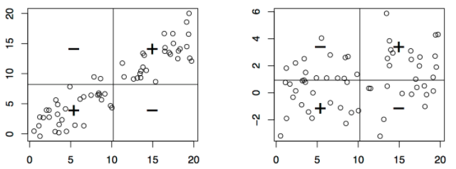
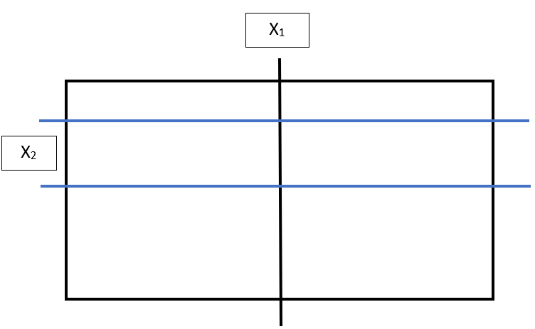

```{r setup, include=FALSE}
knitr::opts_chunk$set(echo=FALSE, message = FALSE, warning = FALSE, fig.width = 8, fig.height = 4)

library(tidyverse)
library(readr)
library(shiny)
library(rmarkdown)
library(dagitty)
library(ggdag)
library(broom)
library(flextable)
library(ggpubr)
```

# Introduction 

**Previous Session**: introduced concepts in statistical inference

**Now**: focus on analytic methods and their implementation in R

# Multivariable Analysis

**Previously**: Discussed simple univariable analyses (comparing means)

Suppose one is interested in how multiple variables are **related distributionally**

**Simplest case**: Two variables $X$ and $Y$

```{r}
dagified <- tidy_dagitty(dagify(x ~~ y))
  
dagified$data <-
  dagified$data %>%
  mutate(y=dagified$data$y[1],
         yend = ifelse(is.na(yend)==1, NA, dagified$data$y[1]))
  
ggplot(data=dagified, mapping=aes(x=x, y=y, xend=xend, yend=yend))+
  geom_dag_point(color="grey", size=20) +
  geom_dag_edges(curvature = 0) +
  geom_dag_text(size=8, color="black") +
  theme_void()
```

# Covariance and Correlation

**Covariance**: $\text{Cov}(X, Y)=\text{E}[(X-\text{E}[X])(Y-\text{E}[Y])]$

Looking inside the outer mean: $(X-\text{E}[X])(Y-\text{E}[Y])$

- Can see $>0$ means both variables in **same direction vs. average**
- $<0$ means both variables in **different directions vs. average**

**Limitation**: relationship size in terms of variable units

**Pearson Correlation**: $\text{Corr}(X, Y)=\frac{\text{Cov}(X,Y)}{\sqrt{\text{Var}(X)}\sqrt{\text{Var}(Y)}}$

**Standardizes** relationship size using variances

# Covariance visual explanation
<center>
<figure>
    
</figure>
</center

**For correlation**: we

1. Center the axes at the mean
2. Set scale for x, y-units in terms of their standard deviation
3. Only **linear** relationships reflected by large correlations

```{r}
set.seed(012)
x <- rnorm(n=100)
y_linear <- 2*x+rnorm(n=100, sd=0.5)
y_quad <- 2*(x^2)+rnorm(n=100, sd=0.5)

par(mfrow=c(1,2))
plot(x=x, y=y_linear, main = paste0("Linear relation: p=", round(cor(x, y_linear),2)), ylab = "y")
plot(x=x, y=y_quad, main = paste0("Quadratic relation: p=", round(cor(x, y_quad),2)), ylab = "y")
```

# Correlation in IBIS

```{r}
data <- read_csv("../../Stats_R_Teaching/Data/Cross-sec_full.csv", 
                 na = c("."))

cor_data <- 
  rbind(tidy(cor.test(data$`V06 mullen,composite_standard_score`, data$`V06 aosi,total_score_1_18`, 
    use="pairwise.complete.obs")) %>% 
  mutate(x_var="V06 MSEL Composite SS",
         y_var="V06 AOSI Raw TS"),
  
tidy(cor.test(data$`V12 mullen,composite_standard_score`, data$`V12 aosi,total_score_1_18`, 
    use="pairwise.complete.obs")) %>% 
  mutate(x_var="V12 MSEL Composite SS",
         y_var="V12 AOSI Raw TS")) %>%
  mutate(p.value=ifelse(p.value<0.005, "<0.005", as.character(round(p.value, 3))))

flextable(cor_data,
          col_keys = c("x_var", "y_var", "estimate", "p.value"))  %>%
  colformat_num(digits = 3) %>% 
  autofit()


ggarrange(ggplot(data=data, mapping=aes(x=`V06 mullen,composite_standard_score`, 
                              y=`V06 aosi,total_score_1_18`))+
  geom_point()+
  geom_smooth(method="lm", se=FALSE)+
  labs(x="V06 MSEL Composite SS", y="V06 AOSI Raw TS", 
       title=paste0("r = ", round(cor_data %>% 
                                      filter(grepl("V06", x_var)) %>%
                                      select(estimate) %>%
                                      unlist(),
                                    2)
                    )
       )+
  theme_bw(),
  
ggplot(data=data, mapping=aes(x=`V12 mullen,composite_standard_score`, 
                              y=`V12 aosi,total_score_1_18`))+
  geom_point()+
  geom_smooth(method="lm", se=FALSE)+
  labs(x="V12 MSEL Composite SS", y="V12 AOSI Raw TS",
       title=paste0("r = ", round(cor_data %>% 
                                      filter(grepl("V12", x_var)) %>%
                                      select(estimate) %>%
                                      unlist(),
                                    2)
                    )
       )+
  theme_bw(),
nrow=1)
```

# Correlation: Assessing Significance

* Pearson Correlation
  + $r=\frac{\sum(x_i-\bar{x})(y_i-\bar{y})}{\sqrt{\sum(x_i-\bar{x})^2}\sqrt{\sum(y_i-\bar{y})^2}}$
  + Test statistic: Under $H_0: \text{Cor}(X,Y)=0$
  1. Assuming $X, Y$ are bi-variate normal
  $T=r\sqrt{\frac{n-2}{1-r^2}} \sim \text{T distribution (DoF = n-2)}$
  
  2. Under large sample approx. by CLT
  $T=r\sqrt{\frac{n-2}{1-r^2}} \sim \text{T distribution (DoF = n-2)}$
  
* Spearman Correlation
  + Better reflects non-linear, **but monotonic**, relationships
  + More robust to outliers
  + **Nonparametric** test based on **rank**, better for small sample size
  
# Correlation Estimates: Example
  
```{r}
# simulate data: this is explained in tutorial 9 for those who are interested
set.seed(123)
E <- rnorm(500, sd=1)
E_linear <- rnorm(500, sd=10)
X <- rnorm(500, sd=4)
Y <- 4/(1+exp(-X))

Y_outliers <- rnorm(5, mean=20)
X_outliers <- rnorm(5, mean=16)
# Outlier example
Y_linear <- c(6*X[1:50]+E_linear[1:50], Y_outliers)
X_w_outliers <- c(X[1:50], X_outliers)

# will use default R plotting functions, which we did not cover
par(mfrow=c(1,2))
plot(X, Y, main="Pearson in black, Spearman in blue", xlim = c(-4, 4), ylim=c(0, 4), ylab="Y")
text(x=-2, y=3.5,labels=paste("Cor=",round(cor(X, Y, method="pearson"),2),sep=""))
text(x=-2, y=3,labels=paste("Cor=",round(cor(X, Y, method="spearman"),2),sep=""), col="blue")
plot(X_w_outliers, Y_linear, main="Pearson in black, Spearman in blue", 
     xlim = c(-2, 18), ylim=c(0, 60), ylab="Y")
text(x=2, y=55,labels=paste("Cor=",
                            round(cor(X_w_outliers, Y_linear, method="pearson"),2),sep=""))
text(x=2, y=50,labels=paste("Cor=",
                            round(cor(X_w_outliers, Y_linear, method="spearman"),2),sep=""), col="blue")

```
  
# Limitations of Correlation

* Assesses how well $X$ and $Y$ "tie together", clinical effect size not well represented
* Only assessses linear or monotonic association
* Adding "confounders" to relationship not straight-forward
* **Doesn't look at mean/median comparisons**

```{r}
# simulate data: this is explained in tutorial 9 for those who are interested
set.seed(123)
E <- rnorm(500)
X <- rnorm(500, mean=5)
Y1 <- 2*X+E
Y2 <- 6*X+E

# will use default R plotting functions, which we did not cover
plot(X, Y1, main="Scatterplot Example: Dataset 1 in black, Dataset 2 in blue", xlim = c(0, 8), ylim=c(0, 50), ylab="Y")
points(X, Y2, col="blue")
text(x=7, y=9,labels=paste("Cor=",round(cor(X, Y1),2),sep=""))
text(x=7, y=35,labels=paste("Cor=",round(cor(X, Y2),2),sep=""), col="blue")
```

# Linear Regression: Setup
Consider variable $X$ and $Y$ again

Consider a **directional** relationship:

```{r}
dagified <- tidy_dagitty(dagify(y ~ x))
  
dagified$data <-
  dagified$data %>%
  mutate(y=dagified$data$y[1],
         yend = ifelse(is.na(yend)==1, NA, dagified$data$y[1]))
  
ggplot(data=dagified, mapping=aes(x=x, y=y, xend=xend, yend=yend))+
  geom_dag_point(color="grey", size=20) +
  geom_dag_edges(curvature = 0) +
  geom_dag_text(size=8, color="black") +
  labs(x="", y="") +
  theme_void()
```

$X$ denoted *independent variable*; $Y$ denoted *dependent variable*

$X$ and $Y$ related **through mean**: $\text{E}(Y|X)=\beta_0+\beta_1X$

# Linear Regression: Setup

**Full Model**:
$$
\begin{align}
&Y=\beta_0+\beta_1X+\epsilon \\
&\\
&\text{where E}(\epsilon)=0 \text{; Var}(\epsilon)=\sigma^2 \\
&\epsilon_i \perp \epsilon_j \text{ for }i\neq j; X\perp \epsilon
\end{align}
$$

```{r}
set.seed(012)
x <- rnorm(n=100)
y_linear <- 2*x+rnorm(n=100, sd=1)

lm_ex_data <-
  data.frame("x"=x, "y"=y_linear)

ggplot(data=lm_ex_data, mapping=aes(x=x, y=y))+
  geom_point()+
  geom_smooth(method="lm", se=FALSE) +
  theme_classic()
```

# Linear Regression: Inference

**Estimation**: 

Find "line of best fit" in data

- Let $\hat{Y_i}=\hat{\beta_0}+\hat{\beta_1}X_i$
- Define *sum of the squared error* $(SSE) = \sum_{i=1}^{n}(\hat{Y_i}-Y_i)^2$
- **Goal**: find $\hat{\beta_0}$ and $\hat{\beta_1}$ which minimize $SSE$
- With single $X$, have 
  1. $\hat{\beta_1}=r_{xy}\frac{\hat{\sigma_y}}{\hat{\sigma_x}}$
  2. $\hat{\beta_0}=\bar{Y}-\hat{\beta}\bar{X}$
  
Can see slope estimate is **scaled correlation**

- $\hat{\beta_0}=\hat{\text{E}}(Y|X=0)$
- $\hat{\beta_1}=\hat{\text{E}}(Y|X=x+1)-\hat{\text{E}}(Y|X=x) \text{ for any }x$

# Linear Regression: Inference

**Confidence Intervals and Testing**:

1. If $\epsilon_i \perp \epsilon_j$ for $i \neq j$ and $\epsilon \sim\text{Normal}(0,\sigma^2)$

- Under $H_0: \beta_p=0$ for $p=0,1$ can create test statistic with $T(n-2)$ distribution
- Use to construct $95\%$ CIs, do hypothesis testing for non-zero $\beta_p$

2. If $\epsilon_i \perp \epsilon_j$ for $i \neq j$ and $\text{Var}(\epsilon_i)=\sigma^2$ for all $i$

- Under $H_0: \beta_p=0$, can do same as above using CLT for "large" sample
- Due to finite sample with CLT, test statistic distribution is "approximate"

# Linear Regression: Covariates

Above all apply for general regression equation:

$Y=\beta_0+\beta_1X1+\ldots+\beta_pX_p+\epsilon$

Where $\text{E}(Y|X_1, \ldots, X_p)=\beta_0+\beta_1X1+\ldots+\beta_pX_p$

$Y|X_1, \ldots, X_p=$ "controlling for $X_1, \ldots, X_p$"

<center>
<figure>
    
</figure>
</center>

# Confounders

- Often illustrated using a DAG (directed acylic graph)

```{r}
dagified <- tidy_dagitty(dagify(y ~ x,
                                z ~ x,
                                y ~ z))
  
ggplot(data=dagified, mapping=aes(x=x, y=y, xend=xend, yend=yend))+
  geom_dag_point(color="grey", size=20) +
  geom_dag_edges(curvature = 0) +
  geom_dag_text(size=8, color="black") +
  theme_void()
```

- X -> Y: $\Delta_x \text{E}(Y|X=x, Z=z)$ 
- X -> Z: $\Delta_x \text{E}(Z|X=x)$ 
- Z -> Y: $\Delta_z \text{E}(Y|Z=z)$ 

# Diagnostics

- **Recall**: Model has a number of assumptions
  + $\text{E}(Y|X_1, \ldots, X_p)=\beta_0+\beta_1X1+\ldots+\beta_pX_p$
  + $\epsilon_i \sim\text{Normal}(0,\sigma^2)$ for all $i$
  + $\epsilon_i \perp \epsilon_j$ for $i \neq j$
  
- Must evaluate if data violates assumptions
  + Generally, $H_0$: Assumptions are met
  
# Diagnostics
  
1. Normality
  + Residual QQ-plot
  <center>
  <figure>
    
  </figure>
  </center>
  
2. Homoskedasicity
  + Residual by fitted value plot
    <center>
  <figure>
    
  </figure>
  </center>
  
# Songs of the Session