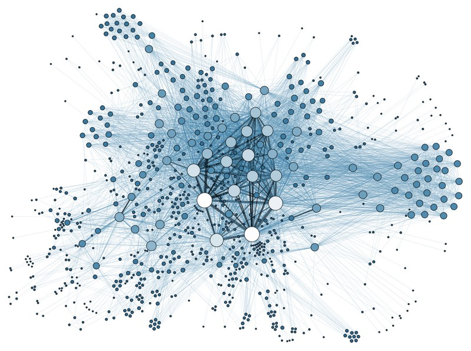
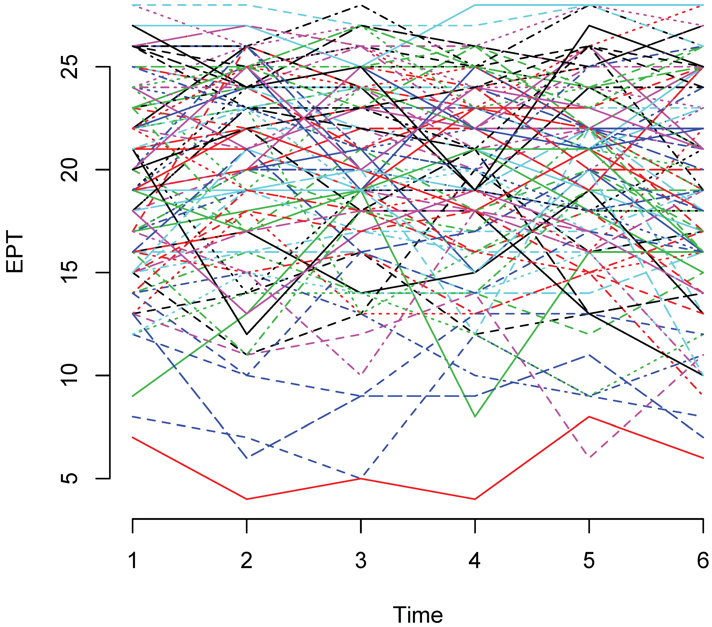
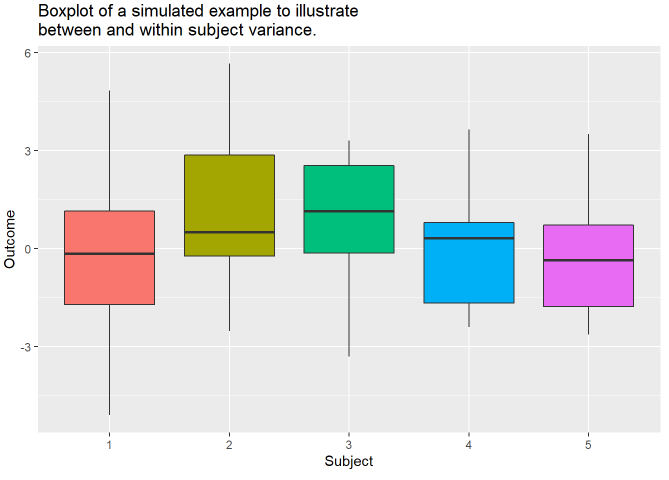

```{r setup, include=FALSE}
knitr::opts_chunk$set(echo=FALSE, message = FALSE, warning = FALSE, fig.width = 8, fig.height = 4)

library(tidyverse)
library(readr)
library(shiny)
library(rmarkdown)
library(dagitty)
library(ggdag)
library(broom)
library(flextable)
library(ggpubr)
library(nlme)
library(lme4)
library(mice)
library(naniar)
```

# Introduction 

**Previous Session**: discussed association analyses with correlation, linear regression

**Now**: focus on longitudinal analyses and linear regression with *clustered data*

# Clustered Data

**Independent Data**: 

- $n$ independent observations
- Ex. outcome $Y$ and covariates $X$ (as vector) have $\{(X_1,Y_1), \ldots, (X_n,Y_n)\}$
- Ex. cross-sectional data with one observation per subject

**Clustered Data**

- $n$ total observations, can be grouped into sets of "dependent" observations or *clusters*
- Ex. suppose we have $K$ clusters, with cluster $k$ having sample size $n_k$

$$
\begin{align}
&\text{Cluster 1}: \{(X_{1,1},Y_{1,1}), \ldots, (X_{1,n_1},Y_{1,n_1})\} \\
&\text{Cluster 2}: \{(X_{2,1},Y_{2,1}), \ldots, (X_{2,n_2},Y_{2,n_2})\} \\
& \ldots \\
&\text{Cluster K}: \{(X_{K,1},Y_{K,1}), \ldots, (X_{K,n_K},Y_{K,n_K})\} \\
\end{align}
$$

# Clustered Data

**Examples**:

{height=40%, width=40%} {height=45%, width=45%}

# Analysis Goals

1. Estimating **population** parameters (mean for example)
  - How to account for dependent observations in estimation and testing?
  - Do we even have to account for this?  Why?

2. Estimating **cluster-specific** parameters (within-cluster means for example)

3. Can we incorporate **both in a single model/analysis framework**?

# Longitudinal Data Exploration

For this session, we focus on **longitudinal data** 

$\leftrightarrow$ "cluster" = single participant

1. Common "first" visualization = *spaghetti plot*

```{r}
# Read in data and convert from wide to long
full_data <- read_csv("../Data/Cross-sec_full.csv", na=c(".", "", " "))

names(full_data) <- gsub(" |,",".",names(full_data))

mixed_model_data <- full_data %>%
  select(Identifiers, GROUP, Gender, Study_Site,
         V36.mullen.composite_standard_score:V12.mullen.composite_standard_score)

vars_to_convert <- names(mixed_model_data)[-1:-4]

mixed_model_data <- mixed_model_data %>%
  gather(variable, var_value, vars_to_convert) %>%
  separate(variable,c("Visit","Variable"),sep=3) %>% 
  spread(key=Variable, value=var_value) %>%
  plyr::rename(c(".mullen.composite_standard_score"="Mullen_Composite_Score")) %>%
  mutate(ASD_Diag = factor(ifelse(grepl("ASD", GROUP), "ASD_Pos", "ASD_Neg")),
         Visit=factor(Visit),
         Visit_Num=as.numeric(Visit)-1) %>%
  arrange(Identifiers, Visit) %>%
  select(Identifiers, Visit, Visit_Num, Gender, Study_Site, ASD_Diag, everything())

# Spaghetti plot
ggplot(data=mixed_model_data,
       mapping=aes(x=Visit_Num, y=Mullen_Composite_Score, color=GROUP))+
  geom_point()+
  geom_line(aes(group=Identifiers), alpha=0.25)+
  geom_smooth(method="lm", se=FALSE)+
  theme_classic()
```

# Longitudinal Data Exploration

2. Visualize patterns of missing data

```{r fig.width = 15, fig.height = 5}
# View missingness patterns
plot_1 <- gg_miss_fct(mixed_model_data %>% select(-Identifiers, -Visit_Num),
            fct=Visit)

plot_2 <- ggplot(mixed_model_data,
       mapping=aes(x=Visit_Num, y=Mullen_Composite_Score))+
  geom_miss_point()+
  theme_classic()

plot_3 <- gg_miss_var(mixed_model_data %>% select(-Identifiers, -Visit_Num),
            facet=Visit)

plot_4 <- gg_miss_var(mixed_model_data %>% select(-Identifiers, -Visit_Num),
            facet=Visit, show_pct = TRUE)

ggarrange(plotlist = list(plot_1, plot_2), nrow=1)
```

# Data analysis

**Goal**: Suppose we want to analyze the associations between variables $X$ and $Y$

* Longitudinal dependence in data maybe **a) nuisance** or **b) of interest**

* Why not just compute Pearson or Spearman correlation between $X$ and $Y$ in whole data?
  * Dependent observations $\rightarrow$ standard error formulas incorrect
  * Correlations estimates **will be correct** but **standard errors too low**
  * $\rightarrow$ p-values **too low** and confidence intervals **don't reach desired rate**
  * Difficult to correct
  
* Okay, what about linear modeling?
  * Method exist which easily adjust for within-subject dependence
  * Two methods: 1) mixed models and 2) GEE
  
# Mixed models

For simplicity, suppose we are interested in the association between $Y$ and covariate $X$

Suppose we also observe time variable $T$, observe each subject $K$ times

**Recall**: Linear regression model with $X$ and $T$ is

$$
\begin{align}
&Y_{i,j}=\beta_0+\beta_1X_{i,j}+\beta_2T_{i,j}+\epsilon_{i,j} \\
&\\
&\text{where E}(\epsilon_{i,j})=0 \text{; Var}(\epsilon_{i,j})=\sigma^2 \\
&\epsilon_{i,j} \perp \epsilon_{k,l} \text{ for }i\neq k|j\neq l
\end{align}
$$

* Dependent observations within subject $\rightarrow$ $\perp$ assumption violated
* **Result**: Estimates $\hat{\beta}$ will be correct but standard errors too low

# Mixed models

**Idea**: Let's tie together observation in the same cluster/subject using *random effects*

**Example**: Suppose want to tie observations in subject together based on *starting point*

**Model**:

$$
\begin{align}
&Y_{i,j}=\beta_0+\beta_1X_{i,j}+\beta_2T_{i,j}+\phi_i+\epsilon_{i,j} \\
&\\
&\text{where E}(\epsilon_{i,j})=0 \text{; Var}(\epsilon_{i,j})=\sigma^2 \\
&\text{where E}(\phi_{i})=0 \text{; Var}(\phi_{i})=\sigma_{\phi}^2; \text{Cor}(\epsilon_{i,j}, \epsilon_{i,l})=\rho_{j,l} \\
& \phi_{i} \perp \phi_{j} \text{ for }i\neq j \\
&\epsilon_{i,j} \perp \epsilon_{k,l} \text{ for }i\neq k
\end{align}
$$
  
# Mixed models

How is this modeling dependence?

1. Between two different subjects, at two different time points:

$$
\begin{align}
&Y_{1,1} = \beta_0+\beta_1X_{1,1}+\beta_2T_{1,1}+\phi_1+\epsilon_{1,1} \\
&Y_{2,2} = \beta_0+\beta_1X_{2,2}+\beta_2T_{2,2}+\phi_2+\epsilon_{2,2}
\end{align}
$$

**Between subjects** all pieces **independent from one another** $\rightarrow$

Variables are independent

2. Within single subject, at two different time points:

$$
\begin{align}
&Y_{1,1} = \beta_0+\beta_1X_{1,1}+\beta_2T_{1,1}+\phi_1+\epsilon_{1,1} \\
&Y_{1,2} = \beta_0+\beta_1X_{1,2}+\beta_2T_{1,2}+\phi_1+\epsilon_{1,2}
\end{align}
$$

* **Within subjects**, dependence comes from $\phi_1$ in both points
* Additional dependence comes from $\text{Cor}(\epsilon_{1,1}, \epsilon_{1,2})$

# Mixed models

- $\phi_i$ an example of a **random effect**
- Random effect = term representing aspect of **subject-specific mean**
  - i.e. randomly assigned piece to each subject which carries through all their observations
  - represents idea of longitudinal data = population data + subject-level data
  
- $\phi_i$ denoted as **random intercept**
  - Represents subject-level deviation from pop-level mean starting point
  
- $\epsilon_{i,j}$ = random fluctuation from subject-specific mean across observations
  - Also induces within-subject correlation
- $\beta_0,\beta_1, \beta_2$ denoted **fixed effects**
  - Represent **population-level** mean relationships
  
# Mixed models

Can represent these different means using our equation

1. Population level mean

$$
\text{E}(Y_{i,j}|X_{i,j}, T_{i,j}) = \beta_0+\beta_1X_{i,j}+\beta_2T_{i,j}
$$

- Averaging across subjects in population
- Since both $\phi_i$ and $\epsilon_{i,j}$ have mean 0, these are moved
- Represents "pop-level trend line" or mean

2. Subject level mean

$$
\text{E}(Y_{i,j}|X_{i,j}, T_{i,j}, \phi_i) = \beta_0+\beta_1X_{i,j}+\beta_2T_{i,j}+\phi_i
$$

- Conditional on $\phi_i$ $\rightarrow$ subject-specific effect stays
- $\epsilon_{i,j}$ has mean 0, is removed
- Represents "subject-level" trend line or mean, for each subject $i$

# Correlation structure

- Means can be decomposed as done before, but so can correlations/covariances

1. Within-subject variance 

- Only random intercept $\rightarrow$ within-subject correlation structure determined by $\text{Cor}(\epsilon_{i,j}, \epsilon_{i,l})$
- Examples of structures
  - **Unstructured**: no assumptions placed on $\text{Cor}(\epsilon_{i,j}, \epsilon_{i,l})$
  - **Independence**: assumes independent residuals
    - $\text{Cor}(\epsilon_{i,j}, \epsilon_{i,l})=0$
    - $\rightarrow$ within-subject correlation represented solely by $\phi_i$
    - Commonly used in analysis for simplicity

# Correlation structure

2. Between-subject variance 

- Subjects assumed independent
- All variation between subjects comes from the following
  1. Covariate values
  2. Variance in $\phi_i$ between subjects
  3. Variance in $\epsilon_{i,j}$
  


# Hierarchical Models

Thus, mixed models often referred to as **hierarchical models**

1. Have subject-level and pop-level mean structure

2. Have within-subject and between-subject variance/covariance

3. Slopes and intercepts also have levels

$$
\begin{align}
&Y_{i,j}=\beta_0+\beta_1X_{i,j}+\beta_2T_{i,j}+\phi_i+\epsilon_{i,j} \\
&Y_{i,j}=[\beta_0+\phi_i]+\beta_1X_{i,j}+\beta_2T_{i,j}+\epsilon_{i,j}\\
&\\
&Y_{i,j}=\beta_{0,i}+\beta_1X_{i,j}+\beta_2T_{i,j}+\epsilon_{i,j}\\
\end{align}
$$

- That is, subject-level slope = fixed effect + random slope

# Hierarchical Models

- We can also add in a **random slope** to reflect subject-specific relationships with a covariate of interest
- Common example: reflect subject-specific mean trend over time

$$
\begin{align}
&Y_{i,j}=\beta_0+\beta_1X_{i,j}+\beta_2T_{i,j}+\phi_{0,i}+\phi_{1,i}T_{i,j}+\epsilon_{i,j} \\
&\\
&\text{where E}(\epsilon_{i,j})=0 \text{; Var}(\epsilon_{i,j})=\sigma^2 \\
&\text{where E}(\phi_{0,i})=\text{where E}(\phi_{1,i})=0 \text{; Var}(\phi_{0,i})=\sigma_{\phi_0}^2 \text{; Var}(\phi_{1,i})=\sigma_{\phi_1}^2\\
& \text{Cor}(\phi_{0,i}, \phi_{1,i})=\rho_{\phi_{0,1}} \\
& \text{Cor}(\epsilon_{i,j}, \epsilon_{i,l})=\rho_{\epsilon_{j,l}} \\
& \phi_{i,l} \perp \phi_{j,m} \text{ for }i\neq j \\
&\epsilon_{i,j} \perp \epsilon_{k,l} \text{ for }i\neq k
\end{align}
$$

- Now have two random effects (intercept and slope for time) $\rightarrow$ can specify their correlation
  - i.e., a subjects own mean starting point may be correlated with their own time-based trajectory
  - Adds additional piece to within-subject correlation
  - Like with $\epsilon$, can specify covariance structure for random effects
  - Often **unstructured** is used
  
# Hierarchical Models

- Can now write the different model levels from this overall model:

1. Population level mean

$$
\text{E}(Y_{i,j}|X_{i,j}, T_{i,j}) = \beta_0+\beta_1X_{i,j}+\beta_2T_{i,j}
$$

- Since $\phi_{0,i}, \phi_{1,i}$ and $\epsilon_{i,j}$ have mean 0, these are removed

2. Subject level mean

$$
\text{E}(Y_{i,j}|X_{i,j}, T_{i,j}, \phi_{0,i}, \phi_{1,i}) = \beta_0+\beta_1X_{i,j}+\beta_2T_{i,j}+\phi_{0,i}+\phi_{1,i}T_{i,j}
$$ 

3. Hierarchical intercepts and slopes

$$
\begin{align}
&Y_{i,j}=\beta_0+\beta_1X_{i,j}+\beta_2T_{i,j}+\phi_{0,i}+\phi_{1,i}T_{i,j}+\epsilon_{i,j} \\
&Y_{i,j}=[\beta_0+\phi_{0,i}]+\beta_1X_{i,j}+[\beta_2+\phi_{1,i}]T_{i,j}+\epsilon_{i,j}\\
& \\
&Y_{i,j}=\beta_{0,i}+\beta_1X_{i,j}+\beta_{2,i}T_{i,j}+\epsilon_{i,j}\\
\end{align}
$$

# Mixed model examples:

See code RMD file

- What about GEE
  - Will discuss next time due to time (briefly!)
  