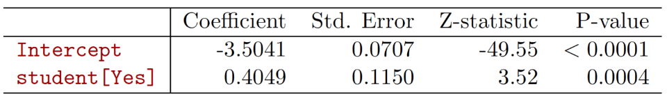
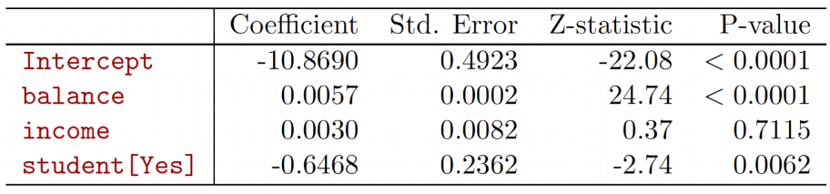
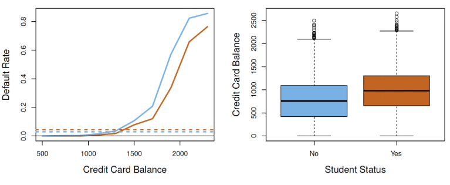

```{r setup, include=FALSE}
knitr::opts_chunk$set(echo=FALSE, message = FALSE, warning = FALSE, fig.width = 8, 
                      fig.height = 4)

library(tidyverse)
library(readr)
library(shiny)
library(rmarkdown)
library(dagitty)
library(ggdag)
library(broom)
library(flextable)
library(ggpubr)
library(nlme)
library(lme4)
library(mice)
library(naniar)
```

# Introduction 

**Recall**: Discussed association analyses with correlation and linear regression

$$
\begin{align}
&Y=\beta_0+\beta_1X_1+\ldots+\beta_pX_p+\epsilon \\
&\\
&\text{where E}(\epsilon)=0 \text{; Var}(\epsilon)=\sigma^2 \\
&\epsilon_i \perp \epsilon_j \text{ for }i\neq j; X_1,\ldots,X_p\perp \epsilon
\end{align}
$$

- What about for discrete outcomes and non-normal error terms?

# Generalized linear model
- **Idea**: Create more general model structure to handle many distributions for outcome and residuals
- Keep flexibility and interpretability of linear regression model
  - Especially flexibility with predictors/covariates (allow continuous, categorical, transformations, etc.)
- Such a structure referred to as *generalized linear models* or GLMs
- Focus on distribution of **outcome** instead of disribution of residuals

# Regression for binary outcomes
- Suppose we want to assess association between binary outcome and predictors
  - Ex. Autism (ASD) diagnosis
- What if we use a linear regression model?
  - $ASD=\beta_0+\beta_1X_1+\ldots+\beta_pX_p+\epsilon$
  - $E(ASD|X)=\beta_0+\beta_1X_1+\ldots+\beta_pX_p$
- For binary $Y$, $\text{E}(Y|X)=\text{Pr}(Y=1|X)$
  - $\rightarrow \text{Pr}(ASD=\text{Yes}|X)=\beta_0+\beta_1X_1+\ldots+\beta_pX_p$
- Denoted *linear probability model*
  - **Limitation**: $0 \leq\text{Pr}(Y=1|X) \leq 1$ but linear function not constrained
  
# Logistic regression
- Specify transformation of probability which is **not constrained**, use linear model
- **Model**: Single Feature $X$
  - $\text{logit}[p(ASD=\text{Yes}|X)]=\beta_0+\beta_1X$
  - $\text{logit}(p)=\text{ln}(\frac{p}{1-p})=\text{log}( \text{odds}[p(Y=1|X)])$
  - This, modeling **log odds** as a linear function of predictors **not probability**
- **In terms of conditional probability**:
  - $p(ASD=\text{Yes}|X)=\frac{e^{\beta_0+\beta_1X}}{1+e^{\beta_0+\beta_1X}}$
  - Can transform logit model to represent probabilities of interest
  
# Logistic regression
- Visualization between probability $p$ and $\text{logit}(p)$
```{r fig.width = 12, fig.height = 4}
logit <- function(x){
  log(x/(1-x))
}

exbit <- function(x){
  exp(x)/(1+exp(x))
}

x_domain_p <- seq(0, 1, by=0.01)

x_domain_p[x_domain_p==0] <- 0.01
x_domain_p[x_domain_p==1] <- 0.99

y_logit <- logit(x_domain_p)

x_domain_logit <- y_logit
y_exbit <- exbit(x_domain_logit)

plot_data <- data.frame(x_domain_p, y_logit, x_domain_logit, y_exbit)

prob_to_logit_plot <-
  ggplot(data=plot_data,
       mapping=aes(x=x_domain_p, y=y_logit))+
    geom_line()+
    xlab("Conditional Probability")+
    ylab("Logit")+
    labs(title = "Transforming probability to logit: logit(p)")+
    theme_classic()+
    theme(text = element_text(size=15))

logit_to_prob_plot <- 
  ggplot(data=plot_data,
         mapping=aes(x=x_domain_logit, y=y_exbit))+
    geom_line()+
    xlab("Logit")+
    ylab("Inverse Logit (Conditional Probability)")+
    labs(title = 
           expression(paste("Transforming logit to probability: ",
                        frac(e^{x},1+e^{x}))))+
    theme_classic()+
    theme(text = element_text(size=15))

ggarrange(plotlist = list(prob_to_logit_plot, logit_to_prob_plot), 
          nrow=1)
```
  
# Logistic regression
- Visualization between probability $p$ and $\text{logit}(p)$ modeling ASD diagnosis
```{r fig.width = 12, fig.height = 4, echo=FALSE}
ibis_data <- read_csv(file = "../Data/Cross-sec_full.csv", na=c("",".","NA","N/A")) %>%
  mutate(SSM_ASD_v24_num = ifelse(SSM_ASD_v24=="YES_ASD", 1,
                                  ifelse(SSM_ASD_v24=="NO_ASD", 0, NA)))

ibis_data_nona <- 
  model.frame(lm(SSM_ASD_v24_num~`V24 mullen,composite_standard_score`, 
             data=ibis_data))
  
ibis_data_nona$prob_asd_linear <-
  predict(lm(SSM_ASD_v24_num~`V24 mullen,composite_standard_score`, 
             data=ibis_data), newdata = ibis_data_nona)

ibis_data_nona$prob_asd_logit <-
  predict(glm(SSM_ASD_v24_num~`V24 mullen,composite_standard_score`, 
              family=binomial(),
             data=ibis_data), newdata = ibis_data_nona)

ibis_data_nona$prob_asd_logistic = 
         exp(ibis_data_nona$prob_asd_logit)/(1+exp(ibis_data_nona$prob_asd_logit))

scatter_linear <- 
  ggplot(data = ibis_data_nona, 
       mapping = aes(x=`V24 mullen,composite_standard_score`, y=SSM_ASD_v24_num))+
  geom_point(aes(color=factor(SSM_ASD_v24_num)))+
  geom_line(mapping=aes(y=prob_asd_linear))+
  scale_y_continuous(breaks=seq(0, 1.2, 0.2))+
  labs(x="24 Month MSEL Composite Score", y="ASD Diagnosis (1=YES)",
       color="ASD Diagnosis")+
  theme_classic()+
  theme(legend.position = "none")

scatter_logistic <- 
  ggplot(data = ibis_data_nona, 
       mapping = aes(x=`V24 mullen,composite_standard_score`, y=SSM_ASD_v24_num))+
  geom_point(aes(color=factor(SSM_ASD_v24_num)))+
  geom_line(mapping=aes(y=prob_asd_logistic))+
  scale_y_continuous(breaks=seq(0, 1.2, 0.2))+
  labs(x="24 Month MSEL Composite Score", y="ASD Diagnosis (1=YES)",
       color="ASD Diagnosis")+
  theme_classic()+
  theme(legend.position = "none")

ggarrange(plotlist=list(scatter_linear, scatter_logistic),
          nrow = 1)
```

# Model fitting
- Since distribution of outcome based on covariates directly modeled, use *maximum likelihood* instead of least squares from before

# Maximum likelihood example

- **Intuition**: 
  - Find estimates of $\beta$ which best match with observed data, assuming data generated from **specified likelihood**
  - Specifying the likelihood directly makes calculations more feasible, but assumptions **may not hold** (more on this later)
  - Fitting in `R`: `glm` function

```{r, echo=FALSE}
glm_fit <- 
  glm(factor(SSM_ASD_v24)~`V24 mullen,composite_standard_score`, 
              family=binomial(),
             data=ibis_data)

# Raw output
summary(glm_fit)

# Format output
tidy(glm_fit) %>%
  mutate(p.value=ifelse(p.value<0.005, "<0.005", 
                        as.character(round(p.value, 3))),
         term=fct_recode(factor(term),
                         "Intercept"="(Intercept)",
                         "24 Month MSEL Composite Standard Score"=
                         "`V24 mullen,composite_standard_score`")) %>%
  flextable() %>%
  set_header_labels("term"="Variable",
                    "estimate"="Estimate",
                    "std.error"="Std. Error",
                    "statistic"="Z Statistic",
                    "p.value"="P-value") %>%
  autofit()
```

# Logistic regression

**Estimated model**:
$\hat{\text{Pr}}[ASD=\text{YES}|MSEL]=\frac{e^{6.67-0.09MSEL}}{1+e^{6.67-0.09MSEL}}$

**Interpretation**:

1. $\hat{\beta_0}=6.67$
- $\hat{\text{Pr}}[ASD=\text{YES}|MSEL=0]=\frac{e^{6.67}}{1+e^{6.67}}$

2. $\hat{\beta_1}=-0.09$
- $\rightarrow$ Probability of ASD diangosis **decreases** as MSEL **increases**

# Logistic regression

**Intercept**:  

- MSEL = 0 doesn't make sense

**Solution**: center at means 

- MSEL - $\mu$ = 0 $\rightarrow$ MSEL = $\mu$

```{r}
ibis_data <- ibis_data %>%
  mutate(mullen_center = `V24 mullen,composite_standard_score` - 
           mean(`V24 mullen,composite_standard_score`, na.rm=TRUE))
  
glm_fit <- 
  glm(factor(SSM_ASD_v24)~mullen_center, 
              family=binomial(),
             data=ibis_data)

# Raw output
summary(glm_fit)

# Format output
tidy(glm_fit) %>%
  mutate(p.value=ifelse(p.value<0.005, "<0.005", 
                        as.character(round(p.value, 3))),
         term=fct_recode(factor(term),
                         "Intercept"="(Intercept)",
                         "24 Month MSEL Composite Centered"=
                         "mullen_center")) %>%
  flextable() %>%
  set_header_labels("term"="Variable",
                    "estimate"="Estimate",
                    "std.error"="Std. Error",
                    "statistic"="Z Statistic",
                    "p.value"="P-value") %>%
  autofit()
```

**Interpretation**:

1. $\hat{\beta_0} = -2.34$

$$
\hat{\text{Pr}}[ASD=\text{YES}|MSEL=\mu]=\frac{e^{-2.34}}{1+e^{-2.34}}
$$

Slope $\hat{\beta_1}$ not changed

# Logistic Regression

Model-based estimated probabilities (non-centered):

For patient with MSEL=100 (mean in population for standard score)

$$
\hat{\text{Pr}}[ASD=\text{YES}|MSEL=90]=\frac{e^{6.67-0.09*90}}{1+e^{6.67-0.09*90}}=0.19
$$

Based on $\hat{\text{Pr}}[ASD=\text{YES}|MSEL=90]$ can create predicted response $\hat{ASD}$ by thresholding

# # Logistic regression: confounding

**Example**: Credit Card Default Rate

- Consider predicting if a person defaults on their loan based on
  - Student Status (Student or Not Student):
  
<center>
<figure>
    
</figure>
</center>

  - Now consider adding features: `credit balance` and `income`
  
<center>
<figure>
    
</figure>
</center>

  - Why did `student`'s coefficient change so much?  **Confounding**

# Logistic regression: confounding

<center>
<figure>
    
</figure>
</center>

- Being a student $\rightarrow$ higher balance (more loans)
  - $\rightarrow$ higher marginal default rate vs non-students
  - But is it the higher balance or simply them being students leading to defaulting more often?
  - Need to compare students and non-students **controlling** for balance to answer this
  - Can be done using regression

# Generalized linear models

- Logistic regression one example of a GLM

**Structure of model**:

1. Choose conditional distribution $f(y|x)$

- Linear regression: $f(y|x)\sim \text{Normal}(\mu_{y|x}, \sigma^2)$
  - $\mu_{y|x} = \text{E}(Y|X); \sigma^2=\text{Var}(Y|X)=\text{Var}(\epsilon)$
- Logistic regression: $f(y|x)\sim \text{Binomial}[p(x)]$
  - $p(x) = \mu_{y|x} = \text{Pr}(Y=1|X)$
  
# Generalized linear models

2. Choose *link function* $g(\mu_{y|x})=\beta_0+\beta_1X_1+\ldots+\beta_pX_p$

- Linear regression: $g(\mu_{y|x})=\mu_{y|x}$
- Logistic regression $g(\mu_{y|x})=\log(\frac{\mu_{y|x}}{1-\mu_{y|x}})$
- **Idea**: $g(\mu_{y|x}):\mathcal{X}_\mu \rightarrow (-\infty, \infty)$

3. Construct likelihood and fit

- Assuming independent observations:
  - $f(y|x)=\prod_{i=1}^{n} f(y_i|x_i)$
  
# Generalized linear models
- Examples include 
  - Poisson regression (outcome is a count)  
  - Gamma regression (outcome is skewed and non-negative)
  - Multinomial logistic (categorical outcome, 2+ categories)
  - Beta, negative binomial, etc.
  
- Most can be fit all using the `glm`() function in R 
  - some, like beta, negative binomial, *overdispered* Poisson, etc. require other packages