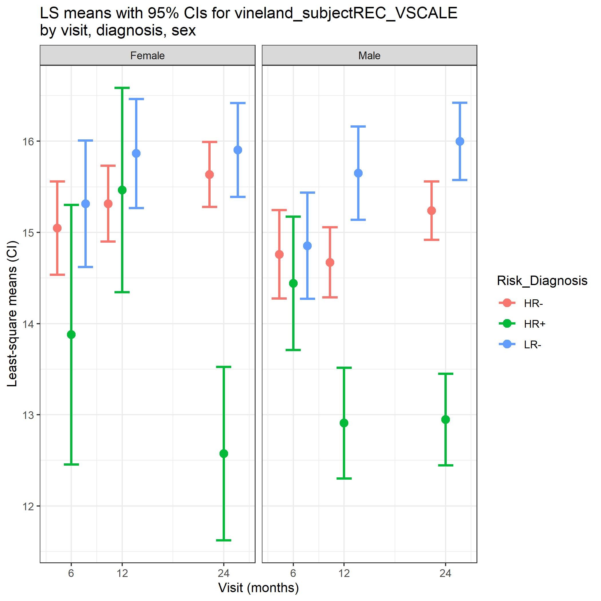
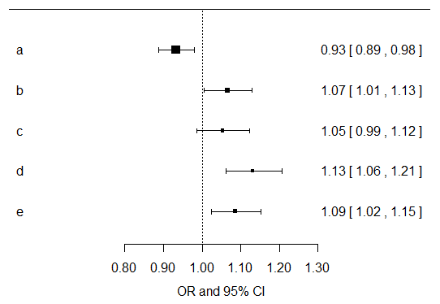

```{r setup, include=FALSE, echo=FALSE}
knitr::opts_chunk$set(echo=FALSE, message = FALSE, warning = FALSE, fig.width = 8, 
                      fig.height = 4)

library(tidyverse)
library(shiny)
library(rmarkdown)
library(broom)
library(gtsummary)
library(flextable)
library(ggpubr)
library(nlme)
library(lme4)
library(broom.mixed)
library(GGally)
library(corrplot)
library(ggcorrplot)
```

```{r}
brain_data <- read_csv("../Data/IBIS_brain_data_ex.csv")
```

# Introduction 

- We have discussed how to do regression analyses
  - Presenting analyses to communicate results just as important
  - Maximizes the impact of your work
- We will use packages we have discussed before: `ggplot`, `gtsummary`, etc.
  - As well as new ones: `GGally`, `corrplot`, etc.
  
<center>
<figure>
    
    <figcaption>Tidyverse</figcaption>
</figure>
</center>

# Correlation analyses

- Correlation analyses often presented using boring tables

```{r}
brain_data_v24 <-
  brain_data %>%
  select(names(brain_data)[grepl("V24", names(brain_data))]) %>%
  select(EACSF_V24:RightAmygdala_V24 )

cor(x=brain_data_v24, method="pearson", use="pairwise.complete.obs")
```

# Correlation analyses

- Instead, let's use visualizations!

```{r fig.width = 7, fig.height = 6}
brain_data_v24 <-
  brain_data %>%
  select(names(brain_data)[grepl("V24", names(brain_data))]) %>%
  select(EACSF_V24:RightAmygdala_V24 )

p.mat <- cor_pmat(brain_data_v24)

ggcorrplot(cor(x=brain_data_v24, method="pearson", use="pairwise.complete.obs"), 
           hc.order = TRUE, type = "lower", lab = TRUE, outline.col = "white",
           p.mat = p.mat)

corrplot(cor(x=brain_data_v24, method="pearson", use="pairwise.complete.obs"))
```

# Correlation analyses

- Can also add in visualizations which look at distributions too

```{r fig.width = 10, fig.height = 8}
brain_data_v24 <-
  brain_data %>%
  select(c(names(brain_data)[grepl("V24", names(brain_data))], "RiskGroup")) %>%
  select(EACSF_V24:RightAmygdala_V24, RiskGroup)

ggpairs(brain_data_v24, 
        columns = names(brain_data_v24)[!grepl("RiskGroup", names(brain_data_v24))],
        ggplot2::aes(colour=RiskGroup, alpha=0.25)) +
  theme(axis.text.x = element_text(angle = 90, vjust = 0.5, hjust=1))
```

# Summary statistics 
- Can create easily formatted summary stats tables **in code**

```{r fig.width = 10, fig.height = 8}
tbl_summary(data=brain_data_v24, by=RiskGroup,
            missing_text = "Missing",
            statistic = list(all_continuous() ~ "{mean} ({sd})")) %>%
  add_p(list(all_continuous() ~ "aov", 
             all_categorical() ~ "chisq")) %>%
  add_n() %>%
  as_flex_table() %>%
  bold(bold = TRUE, part = "header") %>%
  autofit()
```

# Regression summaries
- Let's model 24 month MSEL expressive language scores as Amygdala volume and ASD diagnosis at 24 months
- Common way to look at results: `summary`

```{r}
lm_fit <- lm(V24_MSEL_EL_ae~RiskGroup+RightAmygdala_V24+
               RiskGroup*RightAmygdala_V24, 
             data=brain_data)
summary(lm_fit)
```

- Not very eye catching

# Regression summaries: tables

- Let's start with improved tables containing this same information
- Remade table: `tbl_regression`
  - Can also be used with generalized linear models

```{r}
tbl_regression(lm_fit,
               pvalue_fun = ~style_pvalue(.x, digits = 3),
               estimate_fun = ~style_number(.x, digits = 3)) %>%
  as_flex_table() %>%
  autofit()
```

# Regression summaries: tables

- Can create from scratch using `broom` and `flex_table` packages
  - Can also be used with mixed models using `broom.mixed`

```{r}
summary(lm_fit)
tidy(lm_fit)
```

# Regression summaries: visuals

- Tables tell detailed info, but visuals may make more impact
- Ex. group-specific lines of best fit 

```{r}
lm_fit_data <- model.frame(lm_fit)
lm_fit_data$pred_y <- predict(lm_fit, newdata = lm_fit_data)

ggplot(data=lm_fit_data,
       mapping=aes(x=RightAmygdala_V24, y=V24_MSEL_EL_ae,
                   color=RiskGroup))+
  geom_point()+
  geom_line(mapping=aes(y=pred_y), size=1.5)+
  theme_bw()
```

# Regression summaries: visuals

- Least square means (LS means) are a common way of presenting results in interpretable manner
- Can be computed for cross-sectional regression and mixed models
- How are they computed?

$$
\begin{align}
&MSEL = \beta_0+\beta_1Amyg+\beta_2HRneg+\beta_3LRneg+\beta_4HRneg*Amyg+\beta_5LRneg*Amyg=\epsilon \\
&LSM(HRneg)=\beta_0+\beta_2+\beta_1x+\beta_4x \text{ where x is fixed value, e.g. mean Amygfala} \\
&LSM(LRneg)=\beta_0+\beta_3+\beta_1x+\beta_5x\\
&LSM(HRASD)=\beta_0+\beta_1x
\end{align}
$$

- **Comparing group means** controlling for other covariates in model
- **Note**: not the best metric when interaction terms are included

# Regression summaries: visuals

- LS means can be computed using `lsmeans` function
- Can then plot using `ggplot`

<center>
<figure>
    
    <figcaption>Tidyverse</figcaption>
</figure>
</center>

# Regression summaries: visuals

- Forest plots are one way of visualizing ``beta'' estimates and confidence intervals
- Very useful when you don't have interaction terms and have many main effects

<center>
<figure>
    
</center>

