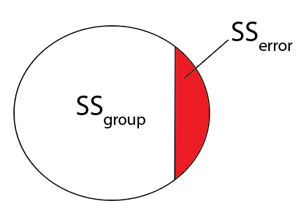

```{r setup, include=FALSE, echo=FALSE}
knitr::opts_chunk$set(echo=FALSE, message = FALSE, warning = FALSE, fig.width = 8, 
                      fig.height = 4)

library(tidyverse)
library(shiny)
library(rmarkdown)
library(broom)
library(gtsummary)
library(flextable)
library(ggpubr)
library(nlme)
library(lme4)
library(broom.mixed)
library(GGally)
library(ggcorrplot)
library(effsize)
library(ggfortify)
```

```{r}
brain_data <- read_csv("../Data/IBIS_brain_data_ex.csv")
```

# Introduction 

- We have discussed how to do regression analyses
  - Presenting analyses to communicate results just as important
  - Maximizes the impact of your work
- Introduced ways to communicate results, continue this discussion
  - Focus on **metrics to use to quantify results** from analyses
  
<center>
<figure>
    
    <figcaption>Tidyverse</figcaption>
</figure>
</center>

# Correlation analyses

- Recall our previous visualizations

```{r fig.width = 7, fig.height = 6}
brain_data_v24 <-
  brain_data %>%
  select(names(brain_data)[grepl("V24", names(brain_data))]) %>%
  select(EACSF_V24:RightAmygdala_V24)

p.mat <- cor_pmat(brain_data_v24)

ggcorrplot(cor(x=brain_data_v24, method="pearson", use="pairwise.complete.obs"), 
           hc.order = TRUE, type = "lower", lab = TRUE, outline.col = "white",
           p.mat = p.mat)
```

# Correlation analyses

- Correlations are an example of an **effect size metric**
  - Metric has **standardized units** of measure of the relationship
  - Strength is same **regardless of scale** for $X$, $Y$
  
$$
\text{Cor}(X,Y)=\frac{\text{Cov}(X,Y)}{\text{Var}(X)\text{Var}(Y)}
$$
  
```{r fig.width = 7, fig.height = 6}
# Generate some random data which is correlated
sim_data <- 
  data.frame(MASS::mvrnorm(n=1000, mu=c(0,0), Sigma=rbind(c(1, 0.75), c(0.75, 1))))

sim_data_v2 <- 
  data.frame(MASS::mvrnorm(n=1000, mu=c(0,0), Sigma=rbind(c(16, 12), c(12, 16))))

plot_list <- 
  list(ggplot(data=sim_data, mapping=aes(x=X1, y=X2))+
  geom_point()+
  geom_smooth(method = "lm")+
  stat_cor()+
  theme_minimal(),
  ggplot(data=sim_data_v2, mapping=aes(x=X1, y=X2))+
  geom_point()+
  geom_smooth(method = "lm")+
  stat_cor()+
  theme_minimal())

ggarrange(plotlist = plot_list, nrow=1)
```

# Group differences

- Can use T-test and F-test to evaluate pairwise differences or multi-group differences:
  - $H_0: \mu_1=\mu_2$
  - $H_1: \mu_1\neq\mu_2$

$$
T=\frac{\bar{X_1}-\bar{X_2}}{s_p\sqrt{\frac{1}{n_1}+\frac{1}{n_2}}} \sim \text{T}_{(n_1+n_2-2)}
$$

  - $H_0: \mu_1=\mu_2=\ldots=\mu_K$
  - $H_1: \text{At least one = is } \neq$
  
$$
F=\frac{\text{between-group variance}}{\text{within-group variance}} \sim \text{F}_{(K-1, N-K)}
$$

# Group differences

- $\bar{X_1}-\bar{X_2}$ depends on units of variables
  - How big of a difference is ``big''?
  - **Effect size**: *Cohen's D*

$$
d=\frac{\bar{X_1}-\bar{X_2}}{s_p}
$$

```{r}
sim_data <- 
  rbind(data.frame("Y"=rnorm(500, 10, sd=1), group="A"),
        data.frame("Y"=rnorm(500, 0, sd=1), group="B"))

sim_data_v2 <- 
  rbind(data.frame("Y"=rnorm(500, 10, sd=4), group="A"),
        data.frame("Y"=rnorm(500, 0, sd=4), group="B"))

data_means <- data.frame("group"=c("A", "B"),
                         "mean"=c(10,0))

plot_list <- 
  list(ggplot(data=sim_data, mapping=aes(x=group, y=Y, color=group))+
  geom_point()+
  geom_hline(data=data_means, mapping=aes(yintercept=mean, color=group))+
  theme_classic()+
  theme(legend.position = "none"),
  
  ggplot(data=sim_data_v2, mapping=aes(x=group, y=Y, color=group))+
  geom_point()+
  geom_hline(data=data_means, mapping=aes(yintercept=mean, color=group))+
  theme_classic()+
  theme(legend.position = "none"))

ggarrange(plotlist = plot_list, nrow=1)
```

  - I.e., just standardizing difference by spread

# Group differences

- How about for F-Test?
  - **Cohen's $f^2$**:

$$
\begin{align}
&f^2=\frac{\eta^2}{1-\eta^2} \\
&\text{ where } \eta^2=\frac{SS_{group}}{SS_{total}}=\frac{SS_{group}}{SS_{group}+SS_{error}}
\end{align}
$$

  - I.e., how much of the variability in variable is related to groups?
  - Easy to calculate from `lm` function in R

<center>
<figure>
    
</figure>
</center>

# Summary statistics 
- Can create easily formatted summary stats tables **in code**
- Add in effect sizes using `add_stat`

```{r fig.width = 10, fig.height = 8}
brain_data_v24 <-
  brain_data %>%
  select(names(brain_data)[grepl("V24|RiskGroup", names(brain_data))]) %>%
  select(RiskGroup, EACSF_V24:RightAmygdala_V24) %>%
  filter(RiskGroup%in%c("HR-Neg", "HR-ASD"))

# Create effect size function using Cohen's d
my_EStest <- function(data, variable, by, ...) {
  d <- effsize::cohen.d(data[[variable]] ~ as.factor(data[[by]]), 
                   conf.level=.95, pooled=TRUE, paired=FALSE, 
                   hedges.correction=TRUE)
  
  # Formatting statistic with CI
  est <- round(d$estimate, 2)
  ci <- round(d$conf.int, 2) %>% paste(collapse = ", ")

  # returning estimate with CI together
  str_glue("{est} ({ci})")
}

tbl_summary(data=brain_data_v24, by=RiskGroup,
            missing_text = "Missing",
            statistic = list(all_continuous() ~ "{mean} ({sd})")) %>%
  add_p(list(all_continuous() ~ "aov", 
             all_categorical() ~ "chisq")) %>%
  add_n() %>%
  add_stat(
    fns = everything() ~ my_EStest,
    fmt_fun = NULL,
    header = "**ES (95% CI)**"
  ) %>%
  modify_footnote(add_stat_1 ~ "Cohen's D (95% CI)") %>%
  as_flex_table() %>%
  bold(bold = TRUE, part = "header") %>%
  autofit()
```

# Summary statistics in regression

- ANOVA

  - Recall: **ANOVA = F-test for multi-group differences**
  - Model:
  
$$
\begin{align}
&MSEL = \beta_0+\beta_1*I(Group=\text{HR-ASD})+\beta_2*I(Group=\text{HR-Neg})+\epsilon \\
& I(Group=\text{x}) \text{ is dummy variable for group x} \\
& \rightarrow \text{LR is reference group}
\end{align}
$$

  - Now can express group difference test in terms of $\beta$
  
$$
\begin{align}
&H_0: \mu_{LR}=\mu_{HR-ASD}=\mu_{HR-Neg} \leftrightarrow\\
&H_0: \beta_0=\beta_0+\beta_1=\beta_0+\beta_2 \leftrightarrow\\
&H_0: \beta_1=\beta_2=0
\end{align}
$$

  - $\rightarrow$ can use Cohen's $f^2$ for effect size
  
# Summary statistics in regression
- General regression
  - Consider model 

$$
MSEL = \beta_0+\beta_1*I(Group=\text{HR-ASD})+\beta_2*I(Group=\text{HR-Neg})+\beta_3*TCV +\epsilon
$$

  - How to define effect sizes for $\beta$ estimates?
  - Metrics:
    - **Semi-partial correlation** $ = \rho_{y,x|z}$ using `ppcor` in R
    - **Adjusted Cohen's D** $ = \tilde{d} = \frac{\hat{\beta}_{group}}{s_{pooled}}$
    - **$R^2$** = $\frac{SS_{total}-SS_{error}}{SS_{total}}$
    - Recall **sum of squares** (SS) is
    
$$
\begin{align}
&SS_{total}=\sum_{i=1}^{n}(y_i-\bar{y})^2 \\
&SS_{error}=\sum_{i=1}^{n}(\epsilon_i)^2
\end{align}
$$
    
# Summary statistics in regression
- Mixed models
  - Consider model 

$$
MSEL = \beta_0+\beta_1*I(Group=\text{HR-ASD})+\beta_2*I(Group=\text{HR-Neg})+\beta_3*TCV+\beta_4*Age+\delta_{0,i}+\delta_{1,i}*Age +\epsilon
$$

  - Looking at changing MSEL over time by group and TCV
  - Random effects: intercept ($\delta_0$), slope for age ($\delta_1$), residual ($\epsilon$)
  - How to compute effect sizes
    - **Group differences** $ = \tilde{d}_{mixed} = \frac{\hat{\beta}_{group}}{\sqrt{\text{Var}(\delta_0)+\text{Var}(\delta_1)+\text{Var}(\epsilon}}$
    - **Semi-partial marginal $R^2$** from `r2glmm` in R

# Regression diagnostics
- With modeling need to assess model fit
  - Residual distribution and variance
  - Outliers and their effects on results
- Can easily create visuals using `ggfortify` and `olsrr`

# Regression diagnostics

```{r}
brain_data_v24 <-
  brain_data %>%
  select(names(brain_data)[grepl("V24|RiskGroup", names(brain_data))])

# Fit model
lm_fit <- lm(V24_MSEL_ELC~RiskGroup+TCV_V24+RiskGroup*TCV_V24, data=brain_data_v24)
ggplot(data=brain_data_v24,
       aes(x=TCV_V24, y=V24_MSEL_ELC, color=RiskGroup))+
  geom_point()+
  geom_smooth(method="lm")
```

```{r}
plot(lm_fit, which=c(1,2,4))
autoplot(lm_fit, which=c(1,2,4), nrow = 1)
```

# Customized visualizations
- Can use `flextable` package with results stored as **data frame**
  - Create any table you want
- Can use `ggplot` with `ggpubr` to combine figures

```{r echo=FALSE, out.height="20%",fig.show='hold',fig.align='center'}
knitr::include_graphics(c("images/ggpubr_example_1.png","images/ggarrange_example.png"))
```