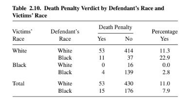
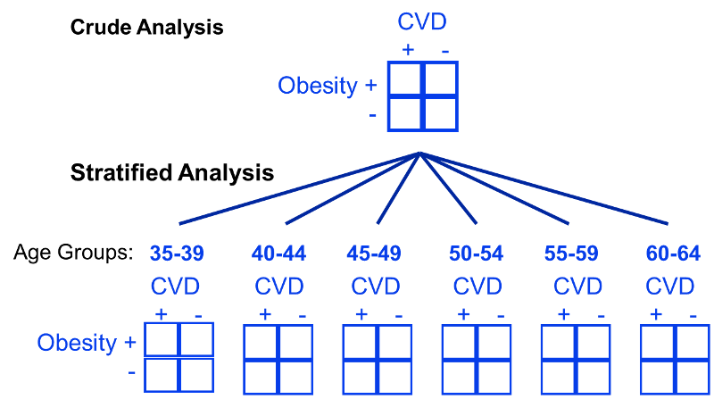
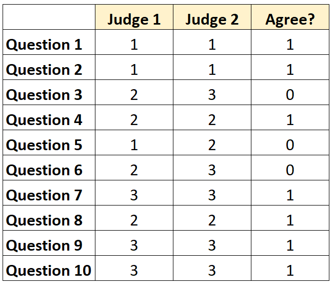

```{r setup, include=FALSE, echo=FALSE}
knitr::opts_chunk$set(echo=FALSE, message = FALSE, warning = FALSE, fig.width = 8, 
                      fig.height = 4)

library(tidyverse)
library(shiny)
library(rmarkdown)
library(broom)
library(gtsummary)
library(flextable)
library(ggpubr)
library(vcd)
library(effsize)
library(ggfortify)
library(irr)
library(summarytools)
```

```{r}
ibis_data <- read_csv("../Data/Cross-sec_full.csv")
```

# Introduction 

- We have discussed how to do many analyses with continuous outcomes
- Also discussed regression with categorical outcomes
- What about analyses with **all categorical outcomes?**

# Contingency Tables
- **Def**
  - Table containing multivariate frequency distributions of variables
  - Can be 2+ dimensions
  - Ex.
  
<center>
<figure>
    
</figure>
</center>

# Research Questions
- Examples of questions one can ask with such data
  1. Are two or more categorical variables independent?
  2. Are two or raters similar for a given measure (i.e. inter-rater reliability)
  
# Testing for independence
- **Def**
  - Let $f_x$ denote the distribution of $X$, $f_y$ distribution of $Y$
  - Let $f_{xy}$ denote the *joint* distribution of $X, Y$
  - Random variables $X$ and $Y$ are independent $\leftrightarrow$ $f_{xy}=f_x*f_y$
  - This is equivalent to $f_{y|x}=f_y$ and $f_{x|y}=f_x$
  
```{r}
addmargins(table(ibis_data$SSM_ASD_v24, ibis_data$Gender))
addmargins(prop.table(table(ibis_data$SSM_ASD_v24, ibis_data$Gender)))

freq(x=ibis_data$SSM_ASD_v24)
```

# Testing for independence
- **Null**: $X$ and $Y$ are independent
- **Alt.**: $X$ and $Y$ are dependent
- Methods
  1. Chi-square test
  2. Fisher's Exact Test
  
# Chi-square test
- **Test statistic**: $\chi^2=\sum_{i} (O_i-E_i)^2/E_i$
  - $O_i=$ observed count in cell $i$ 
  - $E_i=$ expected count in cell $i$ *under null/independence*
  - Large deviation $\rightarrow$ large test statistic $\rightarrow$ low p-value
  - Under null:
    - As $n \rightarrow \infty$, $\chi^2 \rightarrow$ chi-square distribution
    - Degrees of freedom = $(R-1)*(C-1)$ ($R=\#$ of rows, $R=\#$ of columns)

```{r}
table_xtabs <- xtabs(~SSM_ASD_v24+Gender, data=ibis_data)
blah <- summary(table_xtabs)
``` 

# Fisher's Exact Test
- What if $n$ is small?
  - $\rightarrow$ chi-square distribution approx is poor
  - Need alternative test
- Exact test has no ''test statistic'', only a p-value/confidence interval
- P-value is accurate no matter sample size
  - However, more computationally intensive
  - **Use chi-square test** if sample size is large
  
```{r}
table_xtabs <- xtabs(~SSM_ASD_v24+Gender, data=ibis_data)
fisher.test(table_xtabs)
``` 

# More then two variables
- What if we have more then 2 count variables?
  - Ex. may want to assess association between 2 count variables, controlling for third
  - I.e., want to **stratify by 3rd variable**, see if you can reject null
  
<center>
<figure>
    
</figure>
</center> 
  
# Mantel-Haenszel Test
- **Null**: Odds Ratio($X,Y$)=1 for all values of $Z=z$
- **Alt.**: At least one $\neq 1$
- **Test statistic**: $\chi^2_{MH}$
  - Under null:
    - As $n \rightarrow \infty$, $\chi^2 \rightarrow$ chi-square distribution
    - Degrees of freedom = 1
    - Valid for series of 2 by 2 tables
  
```{r}
table_xtabs <- xtabs(~SSM_ASD_v24+Gender+Study_Site, data=ibis_data)
table_xtabs
summary(table_xtabs)
``` 

# Ordinal categories
- Above all assumed categories had no explicit ordering
- **Def**: an *ordinal* variable is a categorical variable where categories have inherent ordering
- Can inform analyses, improve statistical power
- Ex. 
  1. ''linear-by-linear'' test
  2. Cochran-Armitage test (one ordinal, one nominal)
  
# Ordinal regression
- Can also use **regression models** to analyze an ordinal outcome variable
- **Recall**: Logistic Regression

$$
\begin{align}
&\text{logit}(\frac{p_x}{1-p_x})=\beta_0+\beta_1X_1+\ldots+\beta_pX_p \\
& p_x=\Pr(Y=1|X_1=x_1, \ldots, X_p=x_p)
\end{align}
$$

- Ordinal Logistic Regression

$$
\begin{align}
&\text{logit}\bigg(\frac{p_x(j)}{1-p_x(j)}\bigg)=\beta_{0j}+\beta_{1j}X_1+\ldots+\beta_{pj}X_p \\
& p_x(j)=\Pr(Y\leq j|X_1=x_1, \ldots, X_p=x_p)
\end{align}
$$

# Ordinal regression
- Predictors can be of any form (continuous, categorical, etc.)
- Many contingency table tests for association are equivalent to corresponding regreesion model
- **Issue**: Number of parameters in model can be large (as $\beta$ function of $j$)
  - **Solution**: *Proportional odds model*

$$
\begin{align}
&\text{logit}\bigg(\frac{p_x(j)}{1-p_x(j)}\bigg)=\beta_{0j}+\beta_{1}X_1+\ldots+\beta_{p}X_p \\
& p_x(j)=\Pr(Y\leq j|X_1=x_1, \ldots, X_p=x_p)
\end{align}
$$

- Can test for deviation from proportion odds in R (and other software packages)

# Inter-rater reliability
- Suppose you have a measurement, but want to validate it
- One concern: do two people grade the same data similarly using your measurement
- Can visualize the raters' data using a contingency table

<center>
<figure>
    
</figure>
</center>

# Quantifying Aggreement
- Common metric: *Cohen's* $\kappa$
  - $P_0$ = proportion of chance agreement
  - $P_E$ = percentage of agreement expected by random chance
  - Ex. Suppose measurement can be yes or no
    - Say rater one says "yes" $50\%$ of the time, rate two $25\%$ of the time
    - Say rater one says "no" $25\%$ of the time, rate two $50\%$ of the time
    - Then under independence, rater would agree $0.5*0.25+0.25*0.5=25\%$ of the time
    - so $P_E=0.25$
- $\kappa=\frac{P_0-P_E}{1-P_0}$
  
```{r, echo=FALSE}
# Demo data
diagnoses <- as.table(rbind(
  c(7, 1, 2, 3, 0), c(0, 8, 1, 1, 0),
  c(0, 0, 2, 0, 0), c(0, 0, 0, 1, 0),
  c(0, 0, 0, 0, 4)
  ))
categories <- c("Depression", "Personality Disorder",
                "Schizophrenia", "Neurosis", "Other")
dimnames(diagnoses) <- list(Doctor1 = categories, Doctor2 = categories)
diagnoses

# Compute kappa
res.k <- Kappa(diagnoses)
res.k

# Confidence intervals
confint(res.k)
``` 

# Quantifying Aggreement
- Extensions
  1. What if more then 2 raters?  **Light's $\kappa$** (averages all pairwise agreement)
  2. What if variables are ordinal/levels no arbitrary? **Weighted $\kappa$**
- **Note**: Null is rater agree *simply by random chance (or equivalent)*
- Other common measure: intraclass correlation (ICC)
  - `icc` function in `psy` or `irr` packages

```{r, echo=FALSE}
# Load and inspect a demo data
data("diagnoses", package = "irr")
diagnoses

# Compute Light's kappa between 6 raters
kappam.light(diagnoses)
``` 

  