```{r setup, include=FALSE, echo=FALSE}
knitr::opts_chunk$set(echo=FALSE, message = FALSE, warning = FALSE, fig.width = 8, 
                      fig.height = 4)

library(tidyverse)
library(shiny)
library(rmarkdown)
library(broom)
library(gtsummary)
library(flextable)
library(ggpubr)
library(vcd)
library(effsize)
library(ggfortify)
library(irr)
library(summarytools)
library(caret)
library(DMwR)
library(ISLR)
library(pROC)
```

```{r}
ibis_behav_data <- read_csv("../Data/Cross-sec_full.csv", 
                            na = c("", ".")) %>%
  filter(grepl("HR", GROUP))

ibis_fyi_data <- 
  read_csv("../Data/ssm_ibis_fyi_data.csv", 
           na = c("", ".", "BLANK","N0_RL_V12","No_EL","No_Mullen","Partial_Mullen","No_FM")) %>%
  select(Groups, FYIq_1:FYIq_60) %>%
  filter(grepl("HR", Groups))
  
ibis_brain_data <- read_csv("../Data/IBIS_brain_data_ex.csv")
ibis_brain_data <- ibis_brain_data %>%
  select(names(ibis_brain_data)[grepl("V12|RiskGroup|CandID|VDQ", names(ibis_brain_data))]) %>%
  select(CandID:Uncinate_R_V12, RiskGroup:V24_VDQ) %>%
  filter(grepl("HR", RiskGroup))
```

# Introduction

:::: {style="display: flex;"}

::: {}
- Previously focused on *statistical inference*
  - Estimate traits of data generating mechanism/population
  - Testing **a priori** hypotheses
  - Generally using parametric models
- Moving to *machine learning*
  - Focused on pattern recognition and prediction
  - Associations, causal claims and hypothesis testing less of interest
  - Methods data-driven, (generally) limit parametric assumptions
:::

::: {}
<figure>
    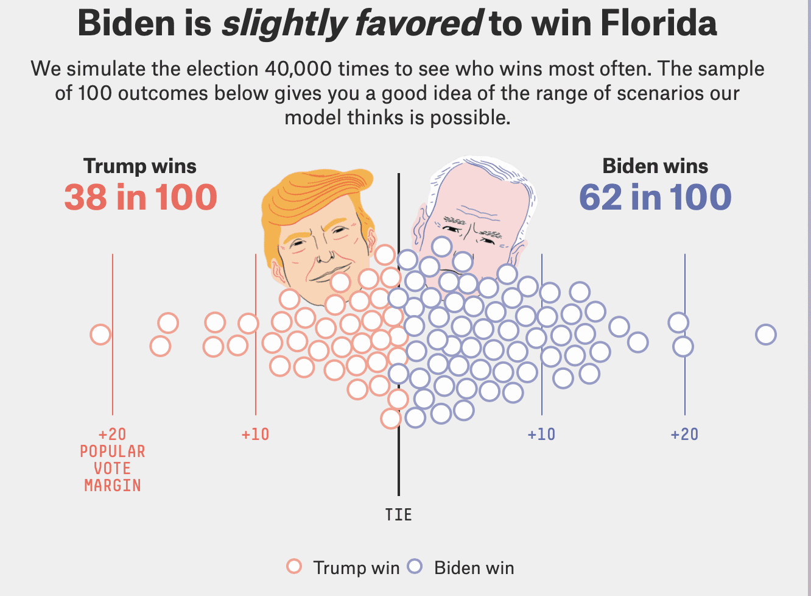
</figure>
:::

::::  

# Machine Learning Basics

:::: {style="display: flex;"}

::: {}
**Steps of process**:

  1. Creating algorithm: *Learning* from observed data
  2. Testing algorithm: Assess quality of *learning*
:::

::: {}
<figure>
    
</figure>
:::

::::  

<div align="center">

**What data to use for what process?**

Need sufficient sample to learn patterns

Train and test on same data $\rightarrow$ **bias**

What do we mean by *bias*?
</div>

# Bias, generalizability, variance

:::: {style="display: flex;"}

::: {}
- Generalizability
  - Algorithm performs well on **independent samples** from population
  - Higher level: generalizes to **different populations**
- Bias
  - **Average over/underperformance** in independent sample vs. observed sample
  - **Only see performance in observed sample**, biased results can be very dangerous!
- Variance
  - Algorithm's accuracy and results differ based on examined data
  - **Not good!** Limits certainty in observed results
:::

::: {}
<figure>
    
</figure>
:::

::::

# Loss function

:::: {style="display: flex;"}

::: {}
- Need some measure of an algorithm's "accuracy/error" for it to learn
- Metric used called *loss function*
  - Varies depending on method or model used
  - Ex. residual sum of squares

$$
\begin{align}
&Y_i = \text{outcome for person }i \\
&X_i = \text{predictor value for person }i \\
&\text{Model: }\hat{Y}_i=\beta_0+\beta_1X_i \\
& \\
&\text{Loss function: }L(\beta_0, \beta_1,Y,X)=\sum_{i=1}^{n}[Y_i-(\beta_0+\beta_1X_i)]^2\\
&\{\hat{\beta}_0, \hat{\beta}_1\} = \{\beta_0, \beta_1\} \text{ which minimizes } L(\beta_0, \beta_1,Y,X)
\end{align}
$$
:::

::: {}
<figure>
    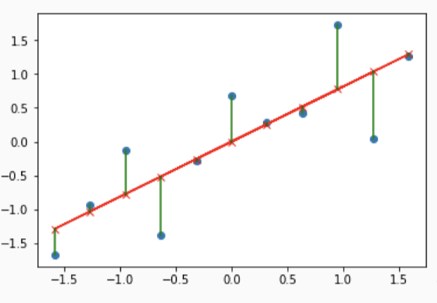
</figure>
:::

::::

# Supervised learning

- Learning when outcome of interest is **observed**
  - Common example: predicting observed trait (diagnosis)
- Can use observed trait in training data to *learn patterns* with predictor variables
- Predictor variables often called *features*
- Differs with *unsupervised learning* (trait **not observed**)

:::: {style="display: flex;"}

::: {}
<figure>
    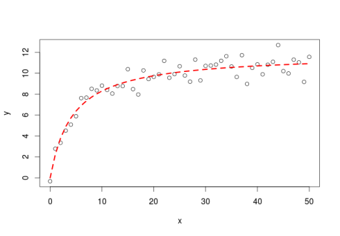
</figure>
:::

::: {}
<figure>
    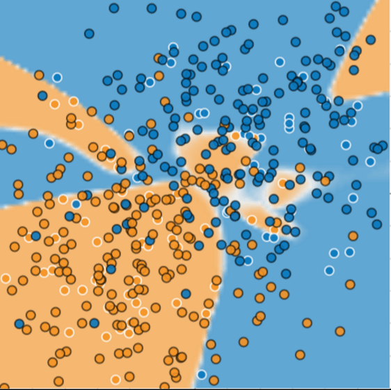
</figure>
:::

::::

# Models and tuning

:::: {style="display: flex;"}

::: {}
- Various models used to train supervised learning algorithm
  - Examples
    1. Linear regression
    2. Logistic regression
    3. Penalized regression
    4. K-means
    5. Decision trees
    6. Support vector machines
    7. Neural networks (*deep learning*)

- Each has set of *tuning parameters* which alter their specific structure
  - Ex. K-means: $k$ = # of neighbors in a neighborhood
  - After tuning set, then model is fixed and training can be done
  - How to determine tuning parameters?
:::

::: {}
<figure>
    
</figure>
:::

::::

# Testing

:::: {style="display: flex;"}

::: {}
- Unbiased testing $\rightarrow$ independent dataset needed
  - Training results may *overfit to training data* $\rightarrow$ **not** reliable metric for general performance
  - Where to get independent dataset?
  
- Testing data sources:
  1. Completely separate sample (from same or different population)
  2. Random partition into 2/3 parts
  3. Random partition into $k$ parts, repeat training and testing process
      - Called *k-fold cross validation* (k-fold CV)
:::

::: {}
<figure>
    
</figure>
:::

::::

# Testing

- Metrics
  - Must choose metrics to quantify algorithm's accuracy/utility
  - Choice depends on many factors:
    1. Continuous or categorical outcome?
    2. Should certain values be weighted differently? (cost may vary by outcome)
    3. What is the purpose of the algorithm (ex. screening tool)?
    
:::: {style="display: flex;"}

::: {}
<figure>
    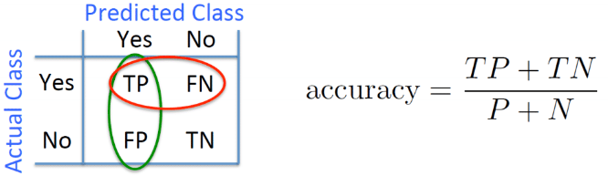
</figure>
:::

::: {}
<figure>
    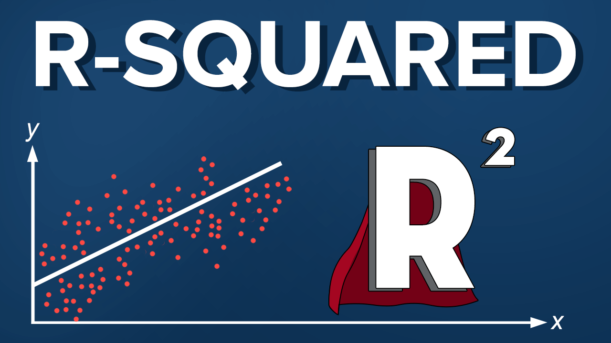
</figure>
:::

::::

# Examples in research
<figure>
    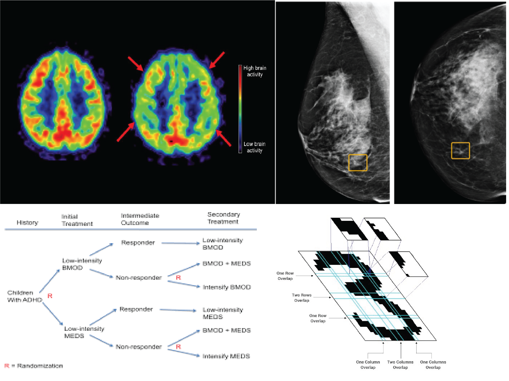
</figure>

# Example with IBIS

- Let's go through examples using IBIS data
  - Will go step-by-step
  - Discuss additional complications that may arise
  - Discuss potential areas of bias and inefficiency
  - Illustrate various methods

# Predicting ASD Diagnosis

- In all cases, we will be attempting to **predict 24 month Autism (ASD) diagnosis**
  - Will try using brain and behavioral measures at 12 months
- Starting point: simple brain model
  - Total brain volume and EACSF at 12 months

```{r}
ggplot(data=ibis_brain_data, mapping=aes(x=EACSF_V12, y=TBV_V12, color=RiskGroup))+
  geom_point()+
  theme_bw()
```

# Predicting ASD Diagnosis

- **Step 1**: Select model
  - We consider K-Nearest Neighbor (KNN) and logistic regression 
  - KNN visualized below
      
```{r fig.width = 5, fig.height = 5}
# KNN fitting on whole data
ibis_brain_data_complete <- 
  ibis_brain_data %>% 
  drop_na() %>% 
  mutate(RiskGroup = factor(RiskGroup)) %>%
  data.frame()

ibis_brain_data_complete_smote <- SMOTE(RiskGroup~EACSF_V12+TBV_V12, 
                                        data = ibis_brain_data_complete,
                                        perc.under = 150)

# Code to plot neighborhoods
decisionplot <- function(model, data, class = NULL, predict_type = "class",
  resolution = 100, showgrid = TRUE, ...) {

  if(!is.null(class)) cl <- data[,class] else cl <- 1
  data <- data[,colnames(model$learn$X)]
  k <- length(unique(cl))

  plot(data, col = as.integer(cl)+1L, pch = as.integer(cl)+1L, ...)

  # make grid
  r <- sapply(data, range, na.rm = TRUE)
  xs <- seq(r[1,1], r[2,1], length.out = resolution)
  ys <- seq(r[1,2], r[2,2], length.out = resolution)
  g <- cbind(rep(xs, each=resolution), rep(ys, time = resolution))
  colnames(g) <- colnames(r)
  g <- as.data.frame(g)

  ### guess how to get class labels from predict
  ### (unfortunately not very consistent between models)
  p <- predict(model, g, type = predict_type)
  if(is.list(p)) p <- p$class
  p <- as.factor(p)

  if(showgrid) points(g, col = as.integer(p)+1L, pch = ".")

  z <- matrix(as.integer(p), nrow = resolution, byrow = TRUE)
  contour(xs, ys, z, add = TRUE, drawlabels = FALSE,
    lwd = 2, levels = (1:(k-1))+.5)

  invisible(z)
}

knn_all_data_fit <-
  knn3(RiskGroup~EACSF_V12+TBV_V12, data=ibis_brain_data_complete_smote, k=5)

decisionplot(model=knn_all_data_fit, data=ibis_brain_data_complete_smote,
             class = "RiskGroup", main = "kNN (5)")

knn_all_data_fit <-
  knn3(RiskGroup~EACSF_V12+TBV_V12, data=ibis_brain_data_complete_smote, k=30)

decisionplot(model=knn_all_data_fit, data=ibis_brain_data_complete_smote,
             class = "RiskGroup", main = "kNN (30)")
```

# Predicting ASD Diagnosis

- **Step 2**: Select training and testing set strategy
  - Generally, will need to use *holdout* method (often hungry for more data!) 
  - Single train-test split or CV?  If CV how many folds?
  - Considerations
    - Interpretability
    - Bias-variance trade-off
 
```{r fig.width = 7, fig.height = 4}
 ## Set degrees being considered:
wage_data <- Wage # contained in ISLR package

degrees <- 1:10
poly_reg_fit <- list()
error_rates_degrees <- list()

# Fit model for each degree considered, compute RMSE (on training in this ex.)
for(i in 1:length(degrees)){
  poly_reg_fit[[i]] <- lm(wage~poly(age, degrees[i]),
                   data=wage_data)
  
  predict_wages <- predict(poly_reg_fit[[i]])
  residuals_wages <- wage_data$wage-predict_wages
  rmse_poly_reg <- sqrt(mean(residuals_wages^2))
  mae_poly_reg <- mean(abs(residuals_wages))
  
  # Save in data frame
  error_rates_degrees[[i]] <-
    data.frame("RMSE"=rmse_poly_reg,
               "MAE"=mae_poly_reg,
               "degree"=degrees[i])
}

# Bind all degree-specific results together into single data frame/table
error_rates_degrees_df <- do.call("rbind", error_rates_degrees)

# Plot results as function of degree
ggplot(data=error_rates_degrees_df,
       mapping=aes(x=degrees, y=RMSE))+
  geom_point()+
  geom_line()+
  labs(title="RMSE (Root Mean Squared Error) by degree without data splitting")

# Line continuously decreases, though seems improvement after 3 or 4 is minimal
# For better assessment, split into training (60:40 split for ex)

# Fit model for each degree considered, compute RMSE (on training in this ex.)
poly_reg_fit <- list()
error_rates_degrees <- list()

counter <- 1
trials <- 15 # Look at 15 different 60:40 splits

wage_data_subset <- wage_data[sample(1:dim(wage_data)[1], size=400, replace=FALSE),]
for(j in 1:trials){
  set.seed(2*j) # Set seed to get different splits
  tt_indicies <- createDataPartition(y=wage_data_subset$wage, p=0.6, list = FALSE)
  wage_data_train <- wage_data_subset[tt_indicies,]
  wage_data_test <- wage_data_subset[-tt_indicies,]
  
  for(i in 1:length(degrees)){
    poly_reg_fit[[counter]] <- lm(wage~poly(age, degrees[i]),
                     data=wage_data_train)
    
    predict_wages <- predict(poly_reg_fit[[counter]], newdata = wage_data_test)
    residuals_wages <- wage_data_test$wage-predict_wages
    rmse_poly_reg <- sqrt(mean(residuals_wages^2))
    mae_poly_reg <- mean(abs(residuals_wages))
    
    # Save in data frame
    error_rates_degrees[[counter]] <-
      data.frame("RMSE"=rmse_poly_reg,
                 "MAE"=mae_poly_reg,
                 "degree"=degrees[i],
                 "split_trial"=j)
    counter <- counter+1
  }
}
  
  # Bind all degree-specific results together into single data frame/table
  error_rates_degrees_df <- do.call("rbind", error_rates_degrees)
  
  # Plot results as function of degree
  ggplot(data=error_rates_degrees_df,
         mapping=aes(x=degree, y=RMSE, color=factor(split_trial)))+
    geom_point()+
    geom_line()+
    labs(title="RMSE (Root Mean Squared Error) by degree on test set\nBy split number")+
    theme_bw()
```

# Drawbacks of holdout
- Test set error can be highly dependent on split
  - Thus **highly variable**
  - Especially for small dataset or **small group sizes**
- Only subset of data used to train algorithm
  - May result in poorer algorithm
  - $\rightarrow$ may **overestimate** test error
- Can we **aggregate results over multiple test sets?**

# K-fold cross validation
- Denote $K$ folds by $C_1, C_2, \ldots, C_K$, each with $n_k$ observations
- For a given fold $l$:
  1. Train algorithm on data in other folds: $\{C_k\}$ s.t. $k\neq l$
  2. Test by computing predicted values for data in $C_l$ **only**
  3. Repeat for each fold $l=1, \ldots, K$, average error (ex. $MSE_l$)

- K fold CV error rate

$$
CV_{(K)}=\sum_{k=1}^{K}\frac{n_k}{n}MSE_k
$$

where $MSE_k=\sum_{i\in C_k}(y_i-\hat{y_i})^2/n_k$ where $y_i$ is outcome and $\hat{y_i}$ is predicted outcome from training on $C_k$ **only**

- $K=n$ yields $n-fold$ or *leave-one out cross-validation*
- $CV_{(K)}$ is accurate measure of generalized error rate for algorithm trained on whole sample

# CV for classification
- Same process as before, divide data into $K$ partitions $C_1, \ldots, C_K$
- Choose error/accuracy rate of interest
  - E.g. sensitivity, specificity, classification error, etc.
- For classification error
  - Compute CV error
  
$$
CV_K=\sum_{k=1}^{K}\frac{n_k}{n}\text{Error}_k=\frac{1}{K}\sum_{k=1}^{K}\text{Error}_k  
$$

where $\text{Error}_k=\sum_{i \in C_k}I(y_i \neq \hat{y_i})/n_k$

- Can we estimate the **variability** of this estimate?
  - Commonly used estimate of standard error:
  
$$
\hat{\text{SE}}(\text{CV}_K)=\sqrt{\sum_{k=1}^{K}(\text{Error}_k-\overline{\text{Error}_k})^2/(K-1)}
$$

  - While useful, not accurate (**Why?**)
  - Also can be used in continuous prediction CV (using MSE for example)
  
# CV visually
- Smoothed estimate of generalized error
<figure>
    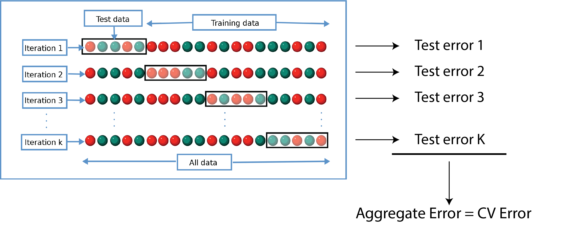
</figure>
    
# Choosing K: bias-variance tradeoff

- **Recall**: Holdout method uses only portion of data for training
  - $\rightarrow$ test/validation performance **overestimate**
  - $\rightarrow$ more folds $\rightarrow$ more data in training folds $\rightarrow$ better algorithm $\rightarrow$ lower mean error
  - $\rightarrow$ LOOCV least biased estimate of test error
- Compared to hold out, each training set in K-fold contains $\frac{(k-1)n}{k}$ obs
  - Generally more then in holdout $\rightarrow$ less biased estimate
  
# CV with tuning
- **Recall**: Often when training a prediction algorithm, need to select **tuning parameters**
  - Ex. \# of neighbors with KNN
  - Where is tuning implemented in CV?
- Example: Consider set of 5000 predictors and 50 samples of data
  - 1. Starting with the 5000 predictors and full data, **first** find 100 predictors with largest correlation with outcome
  - 2. Then train and test an algorithm with only these 100 predictors, using logistic regression as an example
- How do we estimate the algorithm's test set performance without bias?
- Can we only apply CV in step 2, after the predictors have been chosen using the full data?

# NO
- Why?
  - This selection of parameters greatly impacts the algorithm's performance and thus is a form of tuning
  - Tuning needs to be done within the training framework, otherwise you are training and testing on the same dataset
  - Thus, need to do step 1 within your CV scheme
  
# Wrong way: visual
- Only doing step 2 inside CV process

<center>
<figure>
    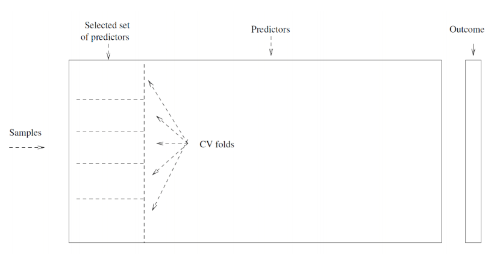
</figure>
</center>

# Right way: visual
- Doing both steps 1 and 2 within CV process

<center>
<figure>
    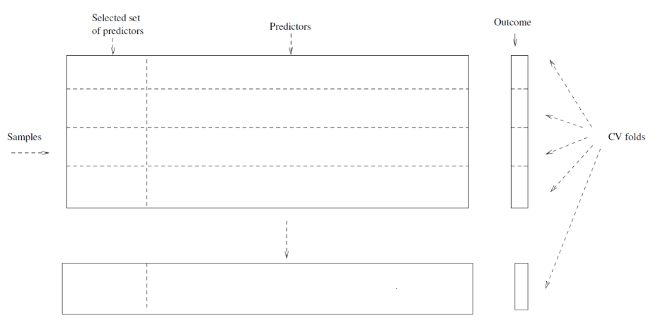
</figure>
</center>

# Right way: visual
- Make sure tuning and testing are done **on separate datasets!**
<center>
<figure>
    
</figure>
</center>

# Concept of a validation set
- Sometimes, **three** data paritions are created
  - One for training, one for *validation*, and one for testing
  - Validation dataset is specifically used for tuning
  - Final fitting done on training+validation, evaluated on testing
  - Separate training and tuning sets **may** $\rightarrow$ more generalizable tuning parameters selected
  - Alternative: do CV with single training/tuning set when tuning (*nested* CV)
  
<center>
<figure>
    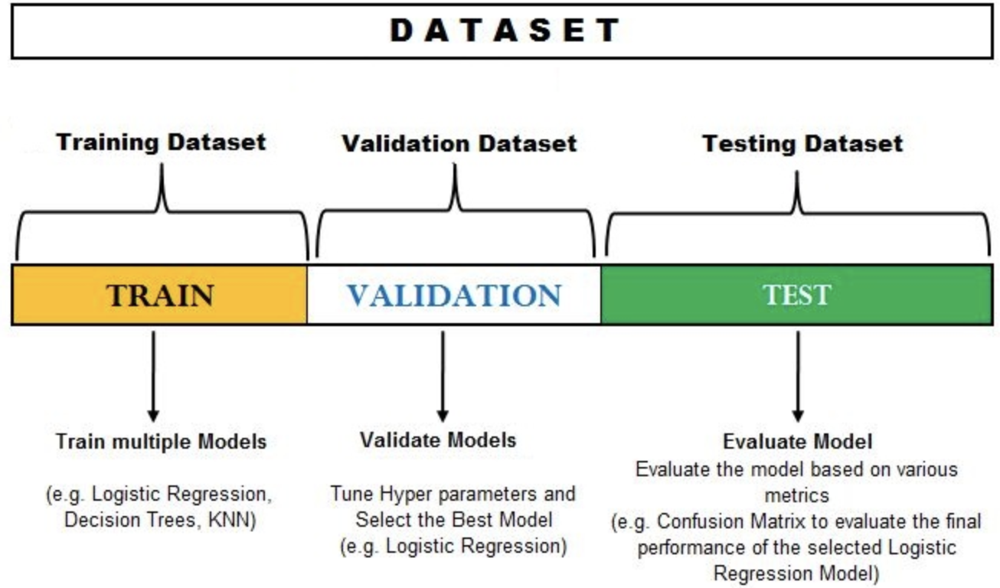
</figure>
</center>

# Predicting ASD Diagnosis
- **Step 2**: Select training and testing set strategy
  - Let's use KNN, tune within CV process using *nested* CV
  
- **Step 3**: Select metric
  - Evaluate on test folds in CV process, CV sensitivity, specificity, etc.
  - Other metrics also available, these suffice for two-group case
  
- Implementation in R: `train` and `createFolds` from `caret` package
  - `train` can be used to tune and train many types of models
  - `postResample` and `confusionMatrix` to see metrics
  
```{r echo=FALSE}
ibis_brain_data_complete <- 
  ibis_brain_data %>% 
  drop_na() %>% 
  mutate(RiskGroup = factor(RiskGroup)) %>%
  data.frame()
```

```{r echo=TRUE, eval=FALSE}
knn_fit <-
  train(RiskGroup~EACSF_V12+TBV_V12, data=ibis_brain_data_complete, 
        tuneLength=10, method="knn", preProcess = c("scale", "center")
        trControl=trainControl(method="cv"))
```

# Implement in R: KNN
```{r echo=TRUE, eval=FALSE}
# Create folds
tt_indices <- createFolds(y=ibis_brain_data_complete$RiskGroup, k=10)

# Do train and test for each fold
for(i in 1:length(tt_indices)){
  # Create train and test sets
  train_data <- ibis_brain_data_complete[-tt_indices[[i]],]
  test_data <- ibis_brain_data_complete[-tt_indices[[i]],]
  
  knn_fit <-
  train(RiskGroup~EACSF_V12+TBV_V12, data=train_data, 
        tuneLength=10, method="knn", preProcess = c("scale", "center")
        trControl=trainControl(method="cv"))
}
```

# Implement in R: KNN
```{r echo=TRUE}
# Create folds
tt_indices <- createFolds(y=ibis_brain_data_complete$RiskGroup, k=10)

# Do train and test for each fold
cv_results <- list()
for(i in 1:length(tt_indices)){
  # Create train and test sets
  train_data <- ibis_brain_data_complete[-tt_indices[[i]],]
  test_data <- ibis_brain_data_complete[-tt_indices[[i]],]
  
  knn_fit <-
  train(RiskGroup~EACSF_V12+TBV_V12, data=train_data, 
        tuneLength=10, method="knn", preProcess = c("scale", "center"),
        trControl=trainControl(method="cv"))
  
  # Save confusion matrix for each fold
  cv_results[[i]] <- confusionMatrix(data=predict(knn_fit, newdata=test_data),
                                     reference=test_data$RiskGroup,
                                     positive="HR-ASD")
}

# Print confusion matrix for a fold
cv_results[[1]]
```

# Unbalanced Data
- Algorithm does terribly for ASD prediction but accuracy is high
  - Good accuracy but poor sensitivity
  - KNN (and most others) use general error as "loss function"
  - $\rightarrow$ if minority class is very small, see **poor performance**
- Solutions
  - Weighting: *weight* minority class more in error calculation
  - Resampling: generate *synthetic sample* with balance between classes
    - Ex. SMOTE
    - Complications?
    
<center>
  <figure>
    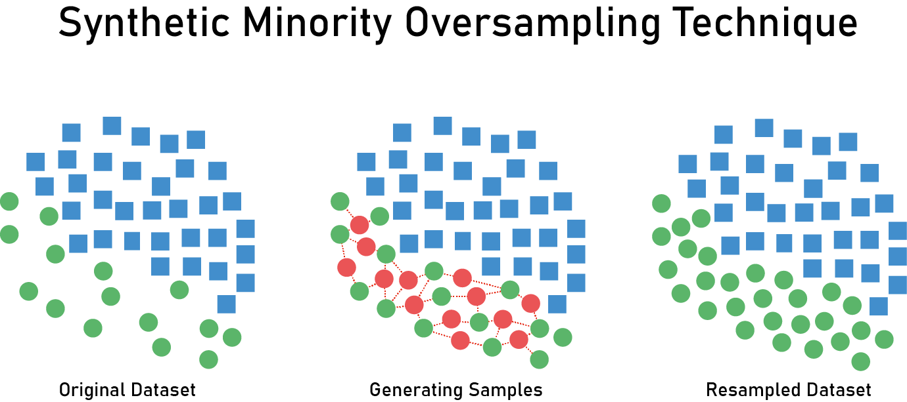
  </figure>
</center>
    
# Weighting

- By default, each obs gets same weight $\rightarrow$ contribute to error the same amount
- But, **error in predicting one type may have higher cost then for other type**
- Can implement this using chosen weights

- Ex. linear regression
  - No weights

$$
\hat{y} = \underset{\beta}{\mathrm{argmin}}\sum_{i=1}^n(y_i-\beta x_i)^2
$$

  - Weights
  
$$
\begin{align}
& \hat{y}_w = \underset{\beta}{\mathrm{argmin}}\sum_{i=1}^nw_i(y_i-\beta x_i)^2 \\
& \text{where } \{w_i\}_{i=1}^n \text{ are subject-specific weights}
\end{align}
$$

- Common choice for weights: *inverse probability weighting*

$$
\begin{align}
& w_i = 1/\hat{\pi}_k \text{ for } k=1,\ldots, K \\
& \text{where } \hat{\pi}_k=\sum_{i=1}^{n} I(i \text{ in group } K)/n
\end{align}
$$

  - Those in rare groups get **high weight**, cost for their error is high
  
# Resampling

- Caveats:
  - SMOTE requires **some** numeric predictors to determine ''neighborhoods'' to draw samples
    - **Ad hoc**: convert categorical to numeric
    - May be suboptimal (**Why?**)
  - Can be difficult to select ROC-based threshold from training set after SMOTE
    - Sometimes threshold chosen from test set, **but this is suboptimal!**
    
# Implement in R

- With `caret` can implement in `train` function (`weights` argument)
- Common SMOTE method: `DmWR` package
  - **However**, package has been removed from CRAN
  - Alternatives: `smotefamily` and `bimba`
  
# Examples
**Inverse probability weighting**
```{r echo=TRUE, eval=FALSE}
# Create training set weights per person
train_weights <- ifelse(ibis_brain_data_complete$RiskGroup=="HR-ASD",
                        1/prop.table(table(ibis_brain_data_complete$RiskGroup))["HR-ASD"],
                        1/prop.table(table(ibis_brain_data_complete$RiskGroup))["HR-Neg"])

knn_fit <-
  train(RiskGroup~EACSF_V12+TBV_V12, data=ibis_brain_data_complete, 
        tuneLength=10, method="knn", preProcess = c("scale", "center")
        trControl=trainControl(method="cv"))
```

**SMOTE**
```{r echo=TRUE}
# Look at frequencies
table(ibis_brain_data_complete$RiskGroup)

# Run SMOTE
ibis_brain_data_complete_smote <- SMOTE(RiskGroup~EACSF_V12+TBV_V12, 
                                        data = ibis_brain_data_complete,
                                        perc.under = 150)
# Now look at frequencies
table(ibis_brain_data_complete_smote$RiskGroup)

knn_fit <-
  train(RiskGroup~EACSF_V12+TBV_V12, data=ibis_brain_data_complete_smote, 
        tuneLength=10, method="knn", preProcess = c("scale", "center"),
        trControl=trainControl(method="cv"))
```

# Logistic regression
- KNN can be adapted to compute probabilities of being in a class (see `knnflex`)
- Logistic regression models these probabilities directly
- Let's try this method instead

```{r echo=TRUE, eval=FALSE}
# Create folds
tt_indices <- createFolds(y=ibis_brain_data_complete$RiskGroup, k=10)

# Do train and test for each fold
cv_results <- list()
for(i in 1:length(tt_indices)){
  # Create train and test sets
  train_data <- ibis_brain_data_complete[-tt_indices[[i]],]
  test_data <- ibis_brain_data_complete[-tt_indices[[i]],]
  
  # Run logistic regression model
  logreg_fit <-
  glm(RiskGroup~EACSF_V12+TBV_V12, data=train_data, 
      family=binomial)
  
  # Save confusion matrix for each fold, use 50% probability threshold
  test_preds <- factor(ifelse(predict(logreg_fit, newdata=test_data, type="response")>0.5, 
                       "HR-Neg", "HR-ASD"))
  cv_results[[i]] <- confusionMatrix(data=predict(logreg_fit, newdata=test_data, type="response"),
                                     reference=test_data$RiskGroup,
                                     positive="HR-ASD")
}
cv_results[[1]]
```

# ROC Curve
- We chose a 0.5 threshold, but this may be suboptimal    
  - Why?
- Instead, can evaluate the performance at **all possible thresholds**
  - Results in a set values which can be plotted: *ROC curve*
  - Can summarize curve: area under the curve (AUC)
- Done in R using `pROC` and `ggroc`

```{r echo=TRUE}
# Run logistic regression model
logreg_fit <-
  glm(RiskGroup~EACSF_V12+TBV_V12, data=ibis_brain_data_complete, 
      family=binomial)

# Get estimated probabilities of HR-ASD
est_probs <- 1-predict(logreg_fit, newdata=ibis_brain_data_complete, type="response")

# Compute ROC curve with AUC
roc_curve <- roc(response=ibis_brain_data_complete$RiskGroup,
                 predictor=est_probs,
                 levels=c("HR-Neg", "HR-ASD"))

# Plot ROC curve
ggroc(roc_curve)+
  labs(title = paste0("AUC = ", round(auc(roc_curve),2)))+
  theme_bw()
  
```

# ROC Curve
- Can use `ggroc` to customize plot more
- Can use various metrics to determine "best" threshold
  - Ex. maximum Youden's index

```{r echo=TRUE}
# Return max Youden's index, with specificity and sensitivity
best_thres_data <- 
  data.frame(coords(roc_curve, x="best", best.method = c("youden", "closest.topleft")))

# View performance at "best threshold"
best_thres_data
data_add_line <-
  data.frame("sensitvity"=c(1-best_thres_data$specificity,
                            best_thres_data$sensitivity),
             "specificity"=c(best_thres_data$specificity,
                            best_thres_data$specificity))
  
ggroc(roc_curve)+
    geom_point(
    data = best_thres_data,
    mapping = aes(x=specificity, y=sensitivity), size=2, color="red")+
    geom_point(mapping=aes(x=best_thres_data$specificity, 
               y=1-best_thres_data$specificity), 
               size=2, color="red")+
    geom_segment(aes(x = 1, xend = 0, y = 0, yend = 1),
                 color="darkgrey", linetype="dashed")+
    geom_text(data = best_thres_data,
              mapping=aes(x=specificity, y=0.90,
                          label=paste0("Threshold = ", round(threshold,2),
                                       "\nSensitivity = ", round(sensitivity,2),
                                       "\nSpecificity = ", round(specificity,2),
                                       "\nAUC = ", round(auc(roc_curve),2))))+
    geom_line(data=data_add_line,
              mapping=aes(x=specificity, y=sensitvity),
              linetype="dashed")+
  theme_classic()
```
