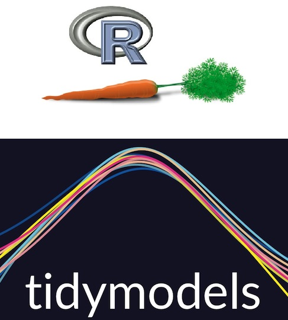

```{r setup, include=FALSE, echo=FALSE}
knitr::opts_chunk$set(echo=FALSE, message = FALSE, warning = FALSE, fig.width = 8, 
                      fig.height = 4)

library(tidyverse)
library(shiny)
library(rmarkdown)
library(broom)
library(gtsummary)
library(flextable)
library(ggpubr)
library(ggfortify)
library(caret)
library(DMwR)
library(ISLR)
library(pROC)
library(e1071)
library(randomForest)
library(splines)
library(glmnet)
```

```{r}
ibis_behav_data <- read_csv("../Data/Cross-sec_full.csv", 
                            na = c("", ".")) %>%
  filter(grepl("HR", GROUP))

ibis_fyi_data <- 
  read_csv("../Data/ssm_ibis_fyi_data.csv", 
           na = c("", ".", "BLANK","N0_RL_V12","No_EL","No_Mullen","Partial_Mullen","No_FM")) %>%
  select(Groups, FYIq_1:FYIq_60) %>%
  filter(grepl("HR", Groups)) %>%
  mutate(Groups=factor(Groups))
  
ibis_brain_data <- read_csv("../Data/IBIS_brain_data_ex.csv")
ibis_brain_data <- ibis_brain_data %>%
  select(names(ibis_brain_data)[grepl("V12|RiskGroup|CandID|VDQ", names(ibis_brain_data))]) %>%
  select(CandID:Uncinate_R_V12, RiskGroup:V24_VDQ) %>%
  filter(grepl("HR", RiskGroup)) %>%
  mutate(RiskGroup=factor(RiskGroup))
```

# Introduction

:::: {style="display: flex;"}

::: {}
- Introduced supervised learning previously
  - Discussed on conceptual level 
  - Now move into a survey of various methods and examples
  - Digging into **coding in R**
- Main packages:
  - `caret`, `e1071`, `randomForest`
  - In development: `tidymodels`
:::

::: {}
<figure>
    
</figure>
:::

::::  

# Linear regression

:::: {style="display: flex;"}

::: {}
- Outcome $Y$ (continuous); predictors $X_1, \ldots, X_p$
  - Model: $\hat{Y_i}=\beta_0+\beta_1X_{i1}+\ldots+\beta_pX_{ip}$
    - $\hat{Y_i}$ is predicted value for subject $i$
    - Need to estimate $\beta$s from training data ($\hat{\beta}_j$)
  - When estimating $\beta$, dependence between obs **not** taken into account
  - **If testing** $\beta$=0, other assumptions from regression apply
  - Can also compute **prediction intervals** per subject from assumptions
:::

::: {}
<figure>
    
</figure>
:::

::::

# Linear regression
- In R can use `train` or usual `lm`

```{r echo=TRUE, fig.width = 8, fig.height = 8}
# LM
lm_fit <- lm(V24_VDQ~EACSF_V12+TCV_V12+LeftAmygdala_V12+RightAmygdala_V12+
               CCSplenium_V12+Uncinate_L_V12+Uncinate_R_V12, 
             data=ibis_brain_data)

tidy(lm_fit) %>% flextable()

## Get predicted values
v24dq_predict <- predict(lm_fit, newdata=ibis_brain_data)

## Remove missing values
train_data <- model.frame(lm_fit)
v24dq_predict <- predict(lm_fit, newdata=train_data)
# or <- lm_fit$fitted.values

## Look at accuracy
## Easiest way: postResample
postResample(pred=v24dq_predict, obs=train_data$V24_VDQ)

# train
lm_fit <- train(V24_VDQ~EACSF_V12+TCV_V12+LeftAmygdala_V12+RightAmygdala_V12+
               CCSplenium_V12+Uncinate_L_V12+Uncinate_R_V12, 
             data=ibis_brain_data,
             method="lm",
             na.action=na.omit)
tidy(lm_fit$finalModel) %>% flextable()

## get training data
## lm_fit$trainingData

## get predicted outcome
v24dq_predict <- predict(lm_fit, newdata=drop_na(lm_fit$trainingData))

## get accuracies
lm_fit$results
postResample(pred=v24dq_predict, obs=drop_na(lm_fit$trainingData)$`.outcome`)

# Different, not sure how the results are computed by default if missing values exists
```

# Linear regression

```{r echo=TRUE, fig.width = 8, fig.height = 7}
## can get prediction intervals also
pred_intervals <- predict(lm_fit$finalModel, newdata=drop_na(lm_fit$trainingData), 
                          interval="predict") %>% as.data.frame() %>% 
  rownames_to_column(var="id")

ggplot(data=pred_intervals[1:100,], mapping = aes(x=id, y=fit))+
  geom_point()+
  geom_errorbar(mapping=aes(ymin=lwr, ymax=upr))+
  geom_hline(yintercept=mean(pred_intervals$fit[1:100]), color="red")+
  coord_flip()+
  theme_bw()+
  theme(axis.text.y = element_blank())
```

# Linear regression
:::: {style="display: flex;"}

::: {}
- We can include non-linear terms in our regression model as well
  - Polynomial terms ($X^2$, $X^3$, etc.)
  - Exponential and log terms ($\exp(X), \log(X)$)
  - Spline
:::

::: {}
```{r fig.width = 6, fig.height = 6}
ggarrange(plotlist=
            list(ggplot()+
                   geom_function(fun = function(x){exp(x)})+
                   labs(title="Exponential")+
                   theme_bw(),
                 ggplot()+
                   geom_function(fun = function(x){log(x)})+
                   labs(title="Log Base E")+
                   theme_bw(),
                 ggplot()+
                   geom_function(fun = function(x){x^2})+
                   labs(title="Quadratic")+
                   theme_bw(),
                 ggplot()+
                   geom_function(fun = function(x){x^3})+
                   labs(title="Cubic")+
                   theme_bw()),
          nrow = 2, ncol = 2)
```  
:::

::::  
  
# Nonlinear regression
:::: {style="display: flex;"}

::: {}
- In general, can replace predictor $X_j$ with function $h(X_j)$
- Model: $\hat{Y_i}=\beta_0+\beta_1h_1(X_{i1})+\ldots+\beta_ph_p(X_{ip})$
  - $h_j(.)$ need to be chosen
  - $h_j(x)=x$ for all $j$ results in linear regression model
- Let's focus on the *spline* model
  - Various types: linear, quadratic, cubic, etc.
  - Spline forces parts to **be connected and smooth**, unlike simple piecewise model
:::

::: {}
<figure>
    
</figure>
:::

::::

# Spline regression
:::: {style="display: flex;"}

::: {}
- Spline structure
  - 1. Basis Functions $b_j(x)$
    - Determine basic shape of each section of spline
    - Ex. linear or cubic
  - 2. Knots $\theta_k$
    - Spots on x-interval where shape changes
  - Model: single $X$
    - $\hat{Y_i}=\beta_0+\beta_1b_1(x)+\beta_2b_2(x)+\ldots+\beta_pb_p(x)$
    - Can add in multiple predictors, use such modeling for each/subset
:::

::: {}
<figure>
    
</figure>
:::

::::

# Spline regression
- Can fit in R using usual modeling functions
  - Just changing how predictors are structured in model
  - Can also use `gam` function or GAM models to extend to GLMs
    - Ex. logistic regression
  - Need `splines` package
    - `bs()` used for standard splines, `ns()` used for *natural splines*

```{r echo=TRUE, fig.width = 15, fig.height = 5}
# LM-cubic spline
lm_fit_cubic <- lm(V24_VDQ~bs(EACSF_V12, degree=3, df=6), 
             data=ibis_brain_data)

#tidy(lm_fit) %>% flextable()

## Knots
cubic_knots <- attr(bs(ibis_brain_data$EACSF_V12, degree=3, df=6), "knots")

# LM-linear spline
lm_fit_linear <- lm(V24_VDQ~bs(EACSF_V12, degree=1, df=6), 
             data=ibis_brain_data)

#tidy(lm_fit) %>% flextable()

## Knots
linear_knots <- attr(bs(ibis_brain_data$EACSF_V12, degree=1, df=6), "knots")

## Get predicted values
ibis_brain_data_plot <- cbind(ibis_brain_data, 
                              "pred_val_cubic"=predict(lm_fit_cubic, newdata=ibis_brain_data),
                              "pred_val_linear"=predict(lm_fit_linear, newdata=ibis_brain_data))

ggarrange(plotlist=list(
  ggplot(data=ibis_brain_data_plot, mapping=aes(x=EACSF_V12, y=V24_VDQ))+
    geom_point()+
    geom_line(mapping=aes(y=pred_val_linear), color="red", size=1.5)+
    geom_vline(xintercept = linear_knots, linetype="dashed")+
    labs(x="12 month EACSF", y="24 month VDQ", title="Linear Spline")+
    theme_bw(),
  ggplot(data=ibis_brain_data_plot, mapping=aes(x=EACSF_V12, y=V24_VDQ))+
    geom_point()+
    geom_line(mapping=aes(y=pred_val_cubic), color="red", size=1.5)+
    geom_vline(xintercept = cubic_knots, linetype="dashed")+
    labs(x="12 month EACSF", y="24 month VDQ", title="Cubic Spline")+
    theme_bw(), 
  ggplot(data=ibis_brain_data_plot, mapping=aes(x=EACSF_V12, y=V24_VDQ))+
    geom_point()+
    geom_smooth(se=FALSE, method="loess", color="red", size=1.5)+
    labs(x="12 month EACSF", y="24 month VDQ", title="LOESS (Local Regress.)")+
    theme_bw(),
  ggplot(data=ibis_brain_data_plot, mapping=aes(x=EACSF_V12, y=V24_VDQ))+
    geom_point()+
    geom_smooth(se=FALSE, method="lm", color="red", size=1.5)+
    labs(x="12 month EACSF", y="24 month VDQ", title="Line of Best Fit")+
    theme_bw()),
  nrow=1, ncol=4)

```

# Logistic regression
- Regression model for binary outcome $Y$
- Model: $\log(\frac{p_i}{1-p_i})=\beta_0+\beta_1X_{i1}+\ldots+\beta_pX_{ip}$
  - $p_i=\Pr(Y_i=1|X_1, \ldots, X_p)$
  - Can incorporate non-linearity using $h_j(.)$ functions, including GAM
  - See previous slides for more info; below looks at using splines
  
```{r echo=TRUE, fig.width = 8, fig.height = 4}
# GLM-cubic spline
# Make sure your outcome is either a factor or 0,1 else will see error!
glm_fit_cubic <- glm(RiskGroup~bs(EACSF_V12, degree=3, df=6), family=binomial, 
             data=ibis_brain_data)

#tidy(lm_fit) %>% flextable()

## Knots
cubic_knots <- attr(bs(ibis_brain_data$EACSF_V12, degree=3, df=6), "knots")

## Get predicted probabilities
ibis_brain_data_plot <- cbind(ibis_brain_data, 
                              "pred_val_cubic"=predict(glm_fit_cubic, newdata=ibis_brain_data,
                                                       type="response"))

ggplot(data=ibis_brain_data_plot, mapping=aes(x=EACSF_V12, y=as.numeric(RiskGroup)-1))+
    geom_point()+
    geom_line(mapping=aes(y=pred_val_cubic), color="red", size=1.5)+
    geom_vline(xintercept = cubic_knots, linetype="dashed")+
    labs(x="12 month EACSF", y="Diagnosis", title="Cubic Spline")+
    theme_bw()
```

# Functional regression
:::: {style="display: flex;"}

::: {}
- Have discussed models where data are a small set of points per person
  - Cross-sectional (1 point); longitudinal (a few points)
- What about where you observe a *function* or *curve* per person?
  - Example: pupil response or accelerometer data
  - Solution: **functional regression models**
- Models can be used for the following:
  1. Functional outcome; scalar predictors
  2. Scalar outcome; functional predictors
  3. Functional outcome; functional predictors
- Can also be used to **predict group** given curve
- [Textbook in R on functional data analysis](https://www.amazon.com/Functional-Data-Analysis-MATLAB-Use/dp/0387981845/ref=sr_1_1?dchild=1&keywords=functional+data+analysis+in+r&qid=1621001113&sr=8-1)
:::

:::{}
<figure>
    
</figure>
:::

::::

# Penalized regression
- What if $p>n?$
  - Traditional regression models won't run; can't compute $\hat{\beta}$
- Solution: could do **variable selection** then re-run
  - Problem: common variable selection methods (*stepwise selection*) **are terrible**
    - [**Never** do stepwise selection](https://journalofbigdata.springeropen.com/articles/10.1186/s40537-018-0143-6)
  - One good model: penalized regression
  
# Penalized regression
- Traditional regression:

$$
\begin{align}
&Y = \beta_0+\beta_1X_1+\ldots+\beta_pX_p+\epsilon \\
&\hat{\beta} = \min_{\beta} \sum_{i=1}^{n} [Y_i-(\beta_0+\beta_1X_1+\ldots+\beta_pX_p)]^2
\end{align}
$$

- Penalized regression:

$$
\begin{align}
&Y = \beta_0+\beta_1X_1+\ldots+\beta_pX_p+\epsilon \\
&\hat{\beta} = \min_{\beta} \sum_{i=1}^{n} [Y_i-(\beta_0+\beta_1X_1+\ldots+\beta_pX_p)]^2+\lambda\sum_{j=1}^{p}||\beta_j||^q \\
&\text{where } \lambda >0
\end{align}
$$

- $||.||^q$ just a measure of size
  - Ex. $q=1$ defines $||\beta_j||^1=|\beta_j|$ ; *LASSO* model
  - $q=2$ defines $||\beta_j||^2=(\beta_j)^2$; *ridge regression* 
  
# Penalized regression
- $\lambda>0$ is a *tuning parameter*, must be chosen
  - Commonly based on hold-out prediction error (ex. CV MSE)
  - Trying to balance **bias-variance tradeoff**
  - **With LASSO**, some $\beta$ set to exactly 0 $\implies$ variable selection is done
  
<figure>
    
</figure>

# Penalized regression
- In R can use `glmnet` package or `train` in combo with `glmnet`

```{r echo=TRUE, fig.width = 11, fig.height = 8}
# Lasso: train
all_image_vars_v12 <- names(ibis_brain_data)[grepl("_V12", names(ibis_brain_data))]
penalized_fit <- 
  train(as.formula(paste0("V24_VDQ", "~", paste0(all_image_vars_v12, collapse="+"))), 
             data=ibis_brain_data %>% drop_na(),
        method="glmnet",
        tuneGrid=expand.grid(alpha=1, lambda=seq(0.1, 10, 0.1)),
        trControl=trainControl(method="cv"))

# Look at results for each lambda
ggplot(data=penalized_fit$results, mapping=aes(x=lambda, y=RMSE))+
  geom_point()+
  geom_vline(xintercept = penalized_fit$bestTune$lambda)+
  theme_bw()

## Get coefficients
lasso_betas <- coef(penalized_fit$finalModel, s=penalized_fit$bestTune$lambda) %>%
  as.matrix() %>%
  data.frame() %>%
  rownames_to_column(var="predictor")

ggplot(data=lasso_betas, mapping=aes(x=predictor, y=X1))+
  geom_point()+
  labs(y="Beta estimate", x="Predictor")+
  theme_bw()+
  theme(axis.text.x = element_text(angle = 90, vjust = 0.5, hjust=1))

## Get predicted values
#v24dq_predict <- predict(penalized_fit, newdata=ibis_brain_data)

## To do logistic model, need Y to be a factor or 0,1 variable
## Or can use glmnet and specify family="binomial"
```

# Decision Trees
- Class of algorithms which represent prediction rule using *trees*
  - Done by partitioning the predictor space, predicting value based on partition membership
  - Can be done when predicting continuous or categorical outcome
  - Two main methods: **CART** and **Random Forest**

<figure>
    
</figure>

# CART
- Partitions predictor space to predict; i.e. creates single tree
  - Splits determined by 1) MSE improvement or 2) Gini's index
  - Splits continue until *stopping rule* reached
    - Example: improvement in MSE is minor, tree is $x$ branches long, etc.
- Then, tree generally *pruned* as likely overfits to the training data
  - Finding subtree $T$ of whole tree $T_0$
  - $\alpha$ is penalty for *size* of $T$ ($|T|$=\# of terminal nodes, $R_m$ is $m^{th}$ partition)
  - $\alpha>0$ needs to be selected, could use CV error
  - Often a large $T_0$ is first created, **then** large tree is pruned

$$
\sum_{m=1}^{|T|}\sum_{i:x_i \in R_m}(y_i-\hat{y}_{R_m})^2+\alpha|T|
$$

# CART in R
- `rpart` and `party` packages in R
- `train` works with `rpart` for `caret implementation
- Pruned done within `train`, `cp` denotes $\alpha$ and is tuning parameter

```{r echo=TRUE, fig.width = 8, fig.height = 8}
# CART using train
cart_fit <- train(as.formula(paste0("V24_VDQ", "~", paste0(all_image_vars_v12, collapse="+"))), 
             data=ibis_brain_data,
             na.action=na.omit,
             method='rpart',
             tuneGrid=expand.grid(cp=seq(0.01, 0.05, length.out = 20)))

ggplot(data=cart_fit$results, mapping=aes(x=cp, y=RMSE))+
  geom_point()+
  theme_bw()

# Or can use plot(cart_fit)
## View tree for pruned model
plot(cart_fit$finalModel)
text(cart_fit$finalModel, digits = 3)

## Get predicted values
#v24dq_predict <- predict(cart_fit, newdata=ibis_brain_data)
```

# CART in R
- Look at unpruned tree
- Can also use `party` with `train` using `method="ctree"` or `="ctree2"
  - Not covered here; `party` has some additional functionality over `rpart`
```{r fig.width = 15, fig.height = 8}
# For unpruned model, set cp=0 in train
cart_fit_unpruned <- train(as.formula(paste0("V24_VDQ", "~", paste0(all_image_vars_v12,
                                                                    collapse="+"))), 
             data=ibis_brain_data,
             na.action=na.omit,
             method='rpart',
             tuneGrid=expand.grid(cp=0))
plot(cart_fit_unpruned$finalModel)
text(cart_fit_unpruned$finalModel, digits = 3)
```

# Random Forest
- CART limitation: only single partitioning being done
  - $\rightarrow$ tree may be too specific to training data
  - Performance in general can be highly variable, suboptimal
  - Improvement: *random forest*
- Random forest is an example of an *ensemble learner*
  - I.e., create an algorithm which combines an **ensemble** of many simple algorithms
  - Take mean/majority vote across parts of ensemble as *final prediction*
  - With random forest, have ensemble of CART (or some other type of tree)
  - Can also use a different percentage when voting; can use ROC to choose
  
# Random Forest
- Analysis Process:
<figure>
    
</figure>

# Random Forest
:::: {style="display: flex;"}

::: {}
- By using ensemble, have more stable prediction algorithm
  - As if you used a panel of doctors to make recommendation (forest) vs. single doctor (tree)
  - "stable"$\rightarrow$ less variance, limit overfitting
  - To get benefit of ensemble, **need trees to be sufficiently different**
    - Done using 1) bootstrap samples and 2) subset of predictors at each split
    - If 2) is not done (all predictors used all the time) get **bagging**
    - Subgroup **not** in bootstrap sample called *out-of-bag sample (OOB)*
:::

::: {}
<figure>
    
</figure>
:::

::::

# Random Forest in R
- `randomForest` package in R
- `train` interacts with this package as well

```{r}
# RF using train
rf_fit <- train(as.formula(paste0("V24_VDQ", "~", paste0(all_image_vars_v12, collapse="+"))), 
             data=ibis_brain_data,
             na.action=na.omit,
             method='rf',
             metric='accuracy',
             trControl=trainControl(method="cv", number=5),
             tuneGrid=expand.grid(mtry=1:5, ntree=c(100, 200, 300, 400, 500)),
             ntree = 500)

# Look at mtry results
rf_fit$results

# Look ntree results for chosen mtry
plot(rf_fit$finalModel)

## Get predicted values
#v24dq_predict <- predict(cart_fit, newdata=ibis_brain_data)
```

# Random Forest in R
- Looking at categorical prediction: 24 month diagnosis in familial likelihood group
```{r}
# RF using train
rf_fit <- train(as.formula(paste0("RiskGroup", "~", paste0(all_image_vars_v12, collapse="+"))), 
             data=ibis_brain_data,
             na.action=na.omit,
             method='rf',
             metric='accuracy',
             trControl=trainControl(method="cv", number=5),
             tuneGrid=expand.grid(mtry=1:5),
             ntree = 500)

# Look at mtry results
rf_fit$results

# Look ntree results for chosen mtry
plot(rf_fit$finalModel)
legend("top", legend=c("HR_ASD", "HR_Neg","Total"), col=c("green","red",
                                                             "black"),cex=0.8,lty=1)

## Get predicted values
#v24dq_predict <- predict(cart_fit, newdata=ibis_brain_data)
```